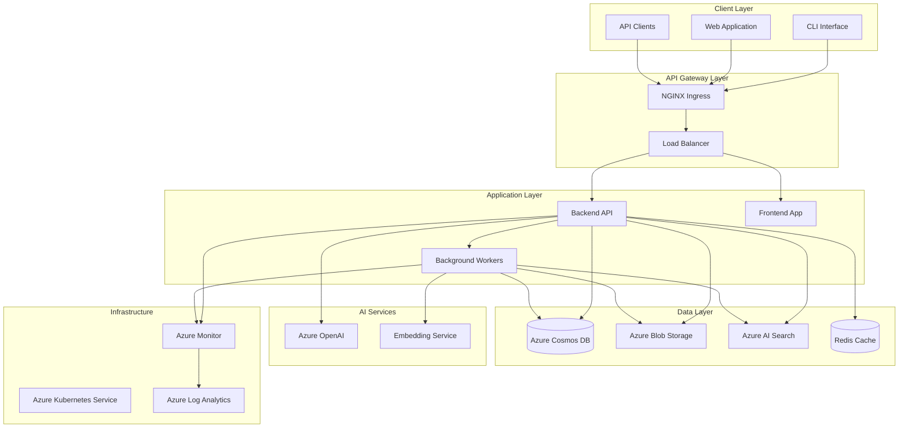

# IntelliVault Architecture Overview

## Executive Summary

IntelliVault is an AI-powered document intelligence platform built on Microsoft Azure that transforms static document repositories into intelligent, searchable knowledge bases. The platform leverages modern cloud-native architecture patterns to deliver semantic search, automated summarization, knowledge graph exploration, and Q&A capabilities at enterprise scale.

## Architecture Principles

### 1. Cloud-Native Design
- **Containerized Services**: All components run in Docker containers on Azure Kubernetes Service (AKS)
- **Microservices Architecture**: Loosely coupled services with clear boundaries and responsibilities
- **API-First Approach**: RESTful APIs with comprehensive OpenAPI documentation
- **Event-Driven Processing**: Asynchronous document processing with queue-based workflows

### 2. Azure-Native Integration
- **Managed Services**: Leverages Azure-managed services for core capabilities
- **Serverless Components**: Uses Azure Functions for lightweight, event-driven tasks
- **Security by Default**: Built-in Azure security features and compliance tools
- **Global Scale**: Multi-region deployment capabilities with Azure's global infrastructure

### 3. AI-First Architecture
- **Semantic Understanding**: Deep integration with Azure OpenAI for advanced language processing
- **Vector Search**: Azure AI Search for similarity-based document discovery
- **Knowledge Graph**: Entity relationship mapping and visualization
- **Continuous Learning**: Feedback loops for improving AI accuracy

## High-Level Architecture



## Core Components

### 1. Frontend Application
- **Technology**: React 18 + TypeScript + Vite
- **Architecture**: Single Page Application (SPA) with component-based design
- **Features**: Document upload, search interface, knowledge graph visualization
- **Deployment**: Static assets served via CDN, containerized for AKS

### 2. Backend API
- **Technology**: Node.js 20 + TypeScript + Express
- **Architecture**: RESTful API with middleware-based request processing
- **Features**: Authentication, document management, search, Q&A endpoints
- **Scaling**: Horizontal scaling with stateless design

### 3. Background Workers
- **Technology**: Node.js + BullMQ + Redis
- **Purpose**: Asynchronous document processing, AI inference, indexing
- **Features**: Job queuing, retry logic, dead letter queues
- **Scaling**: Auto-scaling based on queue depth

### 4. Data Services
- **Azure Cosmos DB**: Operational data, user management, audit logs
- **Azure Blob Storage**: Document storage with hierarchical namespace
- **Azure AI Search**: Vector and semantic search indexes
- **Redis**: Caching and session management

### 5. AI Services
- **Azure OpenAI**: GPT-4 for Q&A, text-embedding-3 for vectorization
- **Custom Models**: Fine-tuned models for domain-specific processing
- **Processing Pipeline**: OCR, entity extraction, summarization

## Technology Stack

### Backend Technologies
- **Runtime**: Node.js 20 LTS
- **Language**: TypeScript 5.9
- **Framework**: Express.js
- **Validation**: Zod schemas
- **Authentication**: JWT + Azure AD integration
- **Queue**: BullMQ with Redis
- **Testing**: Vitest + Playwright

### Frontend Technologies
- **Framework**: React 18
- **Language**: TypeScript
- **Build Tool**: Vite
- **State Management**: React hooks + Context
- **Styling**: CSS-in-JS (TBD)
- **Testing**: Vitest + React Testing Library

### Infrastructure Technologies
- **Container Orchestration**: Kubernetes (AKS)
- **Container Runtime**: Docker
- **Package Management**: Helm charts
- **CI/CD**: GitHub Actions
- **Monitoring**: Azure Monitor + Application Insights
- **Logging**: Structured JSON logging

### Azure Services
- **Compute**: Azure Kubernetes Service (AKS)
- **Database**: Azure Cosmos DB (SQL API)
- **Storage**: Azure Blob Storage
- **Search**: Azure AI Search
- **AI/ML**: Azure OpenAI Service
- **Monitoring**: Azure Monitor, Application Insights
- **Security**: Azure Key Vault, Azure AD

## Key Architectural Patterns

### 1. Microservices Architecture
- **Service Boundaries**: Clear separation between API, workers, and data services
- **Communication**: REST APIs and message queues
- **Deployment**: Independent deployment and scaling
- **Data Ownership**: Each service owns its data domain

### 2. Event-Driven Architecture
- **Asynchronous Processing**: Document ingestion and AI processing
- **Event Sourcing**: Audit trail and state reconstruction
- **CQRS**: Separate read and write models for search optimization
- **Saga Pattern**: Distributed transaction management

### 3. API Gateway Pattern
- **Single Entry Point**: NGINX ingress for all client requests
- **Rate Limiting**: Request throttling and abuse prevention
- **Authentication**: Centralized auth with JWT validation
- **Load Balancing**: Traffic distribution across service instances

### 4. CQRS (Command Query Responsibility Segregation)
- **Read Models**: Optimized for search and analytics queries
- **Write Models**: Optimized for data consistency and validation
- **Eventual Consistency**: Acceptable for search and reporting scenarios
- **Performance**: Separate optimization for read vs. write operations

## Data Architecture

### 1. Data Flow
```
Document Upload → Blob Storage → Processing Queue → AI Services → Search Index → API Response
```

### 2. Data Models
- **Documents**: Metadata, content, processing status
- **Chunks**: Text segments for vector search
- **Entities**: Extracted people, organizations, concepts
- **Relationships**: Entity connections and document links
- **Users**: Authentication, permissions, audit trails

### 3. Storage Strategy
- **Hot Data**: Frequently accessed documents in Cosmos DB
- **Warm Data**: Processed documents in Blob Storage
- **Cold Data**: Archived documents in Azure Archive Storage
- **Search Data**: Vector embeddings and indexes in AI Search

## Security Architecture

### 1. Authentication & Authorization
- **Identity Provider**: Azure Active Directory integration
- **Token Management**: JWT tokens with refresh mechanism
- **Role-Based Access**: Granular permissions per tenant
- **API Security**: Rate limiting and request validation

### 2. Data Protection
- **Encryption**: AES-256 at rest, TLS 1.3 in transit
- **Network Security**: VNet integration, private endpoints
- **Secrets Management**: Azure Key Vault for sensitive data
- **Audit Logging**: Comprehensive activity tracking

### 3. Compliance
- **Data Residency**: Configurable regional data storage
- **GDPR Compliance**: Data retention and right to erasure
- **SOC 2**: Security controls and audit trails
- **HIPAA Ready**: Healthcare data protection capabilities

## Scalability & Performance

### 1. Horizontal Scaling
- **Stateless Services**: Backend API and workers scale independently
- **Auto-scaling**: Kubernetes HPA based on CPU/memory metrics
- **Load Distribution**: NGINX load balancing across instances
- **Queue Scaling**: Worker scaling based on queue depth

### 2. Performance Targets
- **Search Response**: < 2 seconds for 95% of queries
- **Document Processing**: < 5 minutes for standard documents
- **Concurrent Users**: 1000+ simultaneous users
- **Throughput**: 10,000 documents per hour processing

### 3. Caching Strategy
- **Application Cache**: Redis for frequently accessed data
- **CDN**: Static assets and API responses
- **Database Cache**: Cosmos DB integrated caching
- **Search Cache**: AI Search query result caching

## Deployment Architecture

### 1. Environment Strategy
- **Development**: Local Docker Compose setup
- **Staging**: AKS cluster with production-like configuration
- **Production**: Multi-region AKS deployment with high availability

### 2. Deployment Pipeline
- **Source Control**: Git-based workflow with feature branches
- **CI/CD**: GitHub Actions for automated testing and deployment
- **Blue-Green**: Zero-downtime deployment strategy
- **Rollback**: Automated rollback capabilities

### 3. Infrastructure as Code
- **Kubernetes**: Helm charts for application deployment
- **Azure Resources**: ARM templates or Terraform
- **Configuration**: Environment-specific value files
- **Secrets**: Azure Key Vault integration

## Monitoring & Observability

### 1. Metrics Collection
- **Application Metrics**: Custom business metrics and KPIs
- **Infrastructure Metrics**: CPU, memory, network, storage
- **Azure Metrics**: Service-specific metrics and SLAs
- **User Metrics**: Search success rates, response times

### 2. Logging Strategy
- **Structured Logging**: JSON format with consistent schema
- **Log Aggregation**: Azure Log Analytics for centralized logging
- **Request Tracing**: Distributed tracing across services
- **Audit Logging**: Security and compliance event tracking

### 3. Alerting & Notifications
- **Health Checks**: Automated health monitoring
- **SLA Monitoring**: Service level agreement tracking
- **Error Alerting**: Real-time error and exception alerts
- **Capacity Planning**: Resource utilization monitoring

## Future Architecture Considerations

### 1. Multi-Region Deployment
- **Global Distribution**: Deploy across multiple Azure regions
- **Data Replication**: Cross-region data synchronization
- **Traffic Routing**: Intelligent request routing
- **Disaster Recovery**: Automated failover capabilities

### 2. Advanced AI Capabilities
- **Custom Models**: Fine-tuned models for specific domains
- **Real-time Processing**: Stream processing for live document analysis
- **Federated Learning**: Privacy-preserving model training
- **Edge Computing**: AI processing at the edge for low latency

### 3. Integration Ecosystem
- **API Marketplace**: Third-party integrations and extensions
- **Webhook System**: Real-time event notifications
- **SDK Development**: Client libraries for popular languages
- **Plugin Architecture**: Extensible platform capabilities

---

**Document Version**: 1.0  
**Last Updated**: January 2025  
**Next Review**: March 2025
