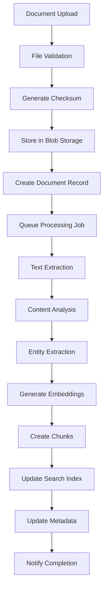
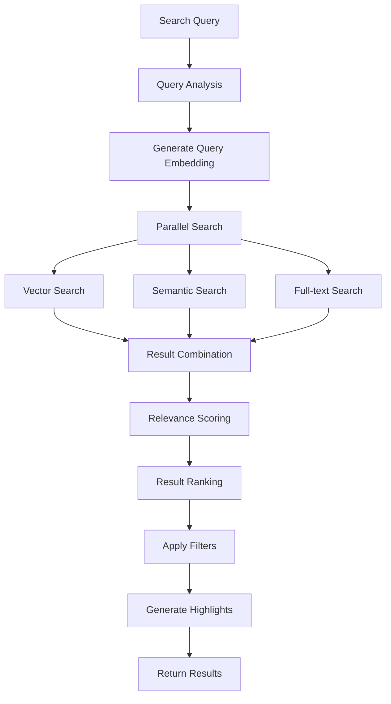
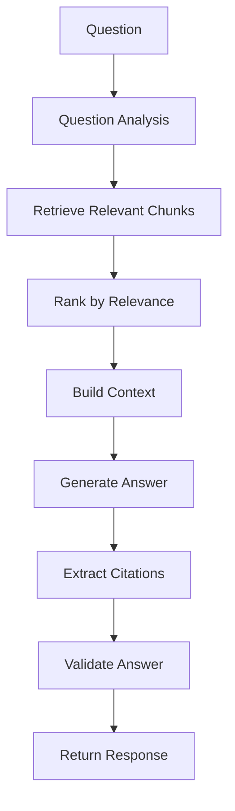

# IntelliVault Data Flow Architecture

## Overview

IntelliVault implements a sophisticated data processing pipeline that transforms raw documents into searchable, intelligent knowledge. The architecture follows event-driven patterns with asynchronous processing, ensuring high throughput and scalability while maintaining data consistency.

## Data Flow Components

### 1. Ingestion Layer
- **Document Upload**: Multi-format file upload with validation
- **Batch Processing**: Bulk document ingestion capabilities
- **Real-time Processing**: Stream processing for immediate feedback
- **Data Validation**: Content and format validation before processing

### 2. Processing Layer
- **Text Extraction**: OCR and content extraction from various formats
- **AI Processing**: Entity extraction, embeddings generation, summarization
- **Chunking**: Intelligent document segmentation for optimal search
- **Quality Assurance**: Content validation and error handling

### 3. Storage Layer
- **Raw Storage**: Original document preservation in Azure Blob Storage
- **Processed Data**: Structured data storage in Azure Cosmos DB
- **Search Indexes**: Vector and semantic indexes in Azure AI Search
- **Caching**: Redis for frequently accessed data

## Document Processing Pipeline



### Processing Stages

#### Stage 1: Upload & Validation
```typescript
class DocumentUploader {
  async uploadDocument(file: UploadedFile, tenantId: string): Promise<UploadResult> {
    // Validate file
    const validation = await this.validateFile(file);
    if (!validation.valid) {
      throw new ValidationError(validation.errors);
    }
    
    // Generate unique identifier
    const documentId = generateDocumentId();
    
    // Compute checksum for deduplication
    const checksum = await this.computeChecksum(file.buffer);
    
    // Check for duplicates
    const existing = await this.findDuplicate(tenantId, checksum);
    if (existing) {
      return { documentId: existing.id, status: 'duplicate' };
    }
    
    // Store in blob storage
    const blobUrl = await this.storeInBlobStorage(file, documentId, tenantId);
    
    // Create document record
    const document = await this.createDocumentRecord({
      id: documentId,
      tenantId,
      filename: file.originalname,
      mimeType: file.mimetype,
      sizeBytes: file.size,
      checksum,
      blobUrl,
      status: 'uploaded'
    });
    
    // Queue for processing
    await this.queueProcessingJob(documentId);
    
    return { documentId, status: 'queued' };
  }
}
```

#### Stage 2: Text Extraction
```typescript
class TextExtractor {
  async extractText(document: Document): Promise<ExtractedContent> {
    const extractors = {
      'application/pdf': new PDFExtractor(),
      'application/vnd.openxmlformats-officedocument.wordprocessingml.document': new WordExtractor(),
      'text/plain': new PlainTextExtractor(),
      'application/vnd.ms-excel': new ExcelExtractor(),
      'application/vnd.openxmlformats-officedocument.presentationml.presentation': new PowerPointExtractor()
    };
    
    const extractor = extractors[document.mimeType];
    if (!extractor) {
      throw new UnsupportedFormatError(document.mimeType);
    }
    
    try {
      const content = await extractor.extract(document.blobUrl);
      
      return {
        text: content.text,
        metadata: {
          pageCount: content.pageCount,
          wordCount: content.wordCount,
          language: content.language,
          structure: content.structure,
          images: content.images,
          tables: content.tables
        }
      };
    } catch (error) {
      await this.handleExtractionError(document.id, error);
      throw error;
    }
  }
}
```

#### Stage 3: Content Analysis
```typescript
class ContentAnalyzer {
  async analyzeContent(content: ExtractedContent): Promise<AnalysisResult> {
    const analysis = await Promise.all([
      this.detectLanguage(content.text),
      this.extractMetadata(content.text),
      this.identifySections(content.text),
      this.classifyDocument(content.text),
      this.detectSentiment(content.text)
    ]);
    
    const [language, metadata, sections, classification, sentiment] = analysis;
    
    return {
      language: language.code,
      confidence: language.confidence,
      metadata: {
        title: metadata.title,
        author: metadata.author,
        creationDate: metadata.creationDate,
        keywords: metadata.keywords,
        summary: metadata.summary
      },
      structure: {
        sections: sections,
        outline: this.generateOutline(sections),
        complexity: this.calculateComplexity(content.text)
      },
      classification: {
        category: classification.category,
        subcategory: classification.subcategory,
        confidence: classification.confidence,
        tags: classification.tags
      },
      sentiment: {
        polarity: sentiment.polarity,
        subjectivity: sentiment.subjectivity,
        emotions: sentiment.emotions
      }
    };
  }
}
```

#### Stage 4: Entity Extraction
```typescript
class EntityExtractor {
  async extractEntities(text: string): Promise<ExtractedEntity[]> {
    const response = await this.openai.chat.completions.create({
      model: 'gpt-4o',
      messages: [{
        role: 'system',
        content: `Extract entities from the following text. Return JSON with:
        - entities: array of {type, name, value, confidence, context}
        - relationships: array of {source, target, relation, confidence}`
      }, {
        role: 'user',
        content: text
      }],
      response_format: { type: 'json_object' }
    });
    
    const result = JSON.parse(response.choices[0].message.content);
    
    return this.normalizeEntities(result.entities, result.relationships);
  }
  
  private normalizeEntities(entities: any[], relationships: any[]): ExtractedEntity[] {
    return entities.map(entity => ({
      id: generateEntityId(),
      type: entity.type.toUpperCase(),
      name: entity.name,
      value: entity.value,
      confidence: entity.confidence,
      context: entity.context,
      relationships: relationships
        .filter(rel => rel.source === entity.name || rel.target === entity.name)
        .map(rel => ({
          id: generateRelationshipId(),
          target: rel.source === entity.name ? rel.target : rel.source,
          relation: rel.relation,
          confidence: rel.confidence
        }))
    }));
  }
}
```

#### Stage 5: Embedding Generation
```typescript
class EmbeddingGenerator {
  async generateEmbeddings(chunks: DocumentChunk[]): Promise<void> {
    const batchSize = 100;
    
    for (let i = 0; i < chunks.length; i += batchSize) {
      const batch = chunks.slice(i, i + batchSize);
      
      // Generate embeddings in parallel
      const embeddingPromises = batch.map(chunk => 
        this.generateEmbedding(chunk.content)
      );
      
      const embeddings = await Promise.all(embeddingPromises);
      
      // Update chunks with embeddings
      const updatePromises = batch.map((chunk, index) => 
        this.updateChunkEmbedding(chunk.id, embeddings[index])
      );
      
      await Promise.all(updatePromises);
    }
  }
  
  private async generateEmbedding(text: string): Promise<number[]> {
    const response = await this.openai.embeddings.create({
      model: 'text-embedding-3-large',
      input: text,
      encoding_format: 'float'
    });
    
    return response.data[0].embedding;
  }
}
```

#### Stage 6: Chunk Creation
```typescript
class DocumentChunker {
  async createChunks(document: Document, content: ExtractedContent): Promise<DocumentChunk[]> {
    const chunkingStrategy = this.selectChunkingStrategy(document.mimeType, content);
    
    switch (chunkingStrategy) {
      case 'semantic':
        return this.semanticChunking(content.text);
      case 'fixed':
        return this.fixedSizeChunking(content.text);
      case 'structure':
        return this.structureBasedChunking(content);
      default:
        return this.adaptiveChunking(content.text);
    }
  }
  
  private async semanticChunking(text: string): Promise<DocumentChunk[]> {
    // Use AI to identify semantic boundaries
    const response = await this.openai.chat.completions.create({
      model: 'gpt-4o',
      messages: [{
        role: 'system',
        content: 'Split the following text into semantic chunks. Each chunk should be self-contained and meaningful. Return JSON with chunks array.'
      }, {
        role: 'user',
        content: text
      }],
      response_format: { type: 'json_object' }
    });
    
    const result = JSON.parse(response.choices[0].message.content);
    
    return result.chunks.map((chunk: any, index: number) => ({
      id: generateChunkId(),
      documentId: document.id,
      tenantId: document.tenantId,
      chunkIndex: index,
      content: chunk.text,
      metadata: {
        semanticBoundary: true,
        topic: chunk.topic,
        confidence: chunk.confidence
      }
    }));
  }
}
```

#### Stage 7: Search Index Update
```typescript
class SearchIndexer {
  async updateSearchIndex(document: Document, chunks: DocumentChunk[], entities: ExtractedEntity[]): Promise<void> {
    // Prepare search documents
    const searchDocuments = chunks.map(chunk => ({
      id: chunk.id,
      document_id: document.id,
      tenant_id: document.tenantId,
      title: document.filename,
      content: chunk.content,
      embedding: chunk.embedding,
      entities: entities
        .filter(e => this.entityInChunk(e, chunk))
        .map(e => e.name),
      metadata: {
        ...chunk.metadata,
        document_metadata: document.metadata,
        chunk_index: chunk.chunkIndex
      },
      created_at: chunk.createdAt
    }));
    
    // Update AI Search index
    await this.aiSearchClient.uploadDocuments('documents', searchDocuments);
    
    // Update entity index
    const entityDocuments = entities.map(entity => ({
      id: entity.id,
      tenant_id: document.tenantId,
      type: entity.type,
      name: entity.name,
      aliases: entity.aliases,
      relationships: entity.relationships,
      metadata: entity.metadata
    }));
    
    await this.aiSearchClient.uploadDocuments('entities', entityDocuments);
  }
}
```

## Search Processing Flow



### Search Implementation
```typescript
class SearchProcessor {
  async processSearch(query: SearchQuery): Promise<SearchResults> {
    const startTime = Date.now();
    
    // Analyze query
    const queryAnalysis = await this.analyzeQuery(query.q);
    
    // Generate query embedding
    const queryEmbedding = await this.generateQueryEmbedding(query.q);
    
    // Execute parallel searches
    const [vectorResults, semanticResults, textResults] = await Promise.all([
      this.vectorSearch(queryEmbedding, query),
      this.semanticSearch(query.q, query),
      this.textSearch(query.q, query)
    ]);
    
    // Combine and rank results
    const combinedResults = this.combineSearchResults(
      vectorResults,
      semanticResults,
      textResults,
      queryAnalysis
    );
    
    // Apply additional filters
    const filteredResults = this.applyFilters(combinedResults, query.filters);
    
    // Generate highlights
    const highlightedResults = await this.generateHighlights(filteredResults, query.q);
    
    return {
      results: highlightedResults,
      totalCount: filteredResults.length,
      queryTime: Date.now() - startTime,
      suggestions: await this.generateSuggestions(query.q),
      facets: await this.generateFacets(query, filteredResults)
    };
  }
}
```

## Q&A Processing Flow



### Q&A Implementation
```typescript
class QAProcessor {
  async processQuestion(question: QAQuery): Promise<QAResponse> {
    // Analyze question
    const questionAnalysis = await this.analyzeQuestion(question.question);
    
    // Retrieve relevant chunks
    const relevantChunks = await this.retrieveRelevantChunks(
      question.question,
      question.tenantId,
      question.k || 10
    );
    
    // Rank chunks by relevance
    const rankedChunks = await this.rankChunksByRelevance(
      relevantChunks,
      question.question
    );
    
    // Build context
    const context = this.buildContext(rankedChunks);
    
    // Generate answer using LLM
    const answer = await this.generateAnswer(question.question, context);
    
    // Extract citations
    const citations = this.extractCitations(answer, rankedChunks);
    
    // Validate answer quality
    const validation = await this.validateAnswer(answer, question.question, context);
    
    return {
      answer: answer.text,
      citations: citations,
      confidence: answer.confidence,
      sources: citations.map(c => ({
        documentId: c.documentId,
        chunkIndex: c.chunkIndex,
        relevance: c.relevance
      })),
      metadata: {
        processingTime: Date.now() - startTime,
        chunksUsed: rankedChunks.length,
        validation: validation
      }
    };
  }
}
```

## Data Synchronization

### Event-Driven Updates
```typescript
class EventProcessor {
  async processEvent(event: DomainEvent): Promise<void> {
    switch (event.type) {
      case 'DOCUMENT_UPDATED':
        await this.updateDocumentIndex(event.payload);
        break;
      case 'DOCUMENT_DELETED':
        await this.removeFromIndex(event.payload);
        break;
      case 'ENTITY_UPDATED':
        await this.updateEntityRelations(event.payload);
        break;
      case 'USER_PERMISSIONS_CHANGED':
        await this.updateAccessControl(event.payload);
        break;
    }
  }
}
```

### Data Consistency
```typescript
class DataConsistencyManager {
  async ensureConsistency(documentId: string): Promise<void> {
    const document = await this.getDocument(documentId);
    const chunks = await this.getDocumentChunks(documentId);
    const entities = await this.getDocumentEntities(documentId);
    
    // Verify search index consistency
    const indexChunks = await this.getIndexedChunks(documentId);
    if (chunks.length !== indexChunks.length) {
      await this.reindexDocument(documentId);
    }
    
    // Verify entity relationships
    await this.validateEntityRelationships(entities);
    
    // Update metadata
    await this.updateDocumentMetadata(documentId, {
      chunksCount: chunks.length,
      entitiesCount: entities.length,
      lastIndexed: new Date()
    });
  }
}
```

## Performance Optimization

### Batch Processing
```typescript
class BatchProcessor {
  async processBatch(items: any[], processor: Function, batchSize: number = 100): Promise<any[]> {
    const results: any[] = [];
    
    for (let i = 0; i < items.length; i += batchSize) {
      const batch = items.slice(i, i + batchSize);
      const batchResults = await Promise.all(
        batch.map(item => processor(item))
      );
      results.push(...batchResults);
      
      // Add delay to prevent rate limiting
      await this.sleep(100);
    }
    
    return results;
  }
}
```

### Caching Strategy
```typescript
class CacheManager {
  private cache = new Map<string, CachedItem>();
  
  async get<T>(key: string, fetcher: () => Promise<T>, ttl: number = 300): Promise<T> {
    const cached = this.cache.get(key);
    
    if (cached && !this.isExpired(cached)) {
      return cached.value;
    }
    
    const value = await fetcher();
    this.cache.set(key, {
      value,
      expiresAt: Date.now() + ttl
    });
    
    return value;
  }
}
```

---

**Document Version**: 1.0  
**Last Updated**: January 2025  
**Next Review**: March 2025
