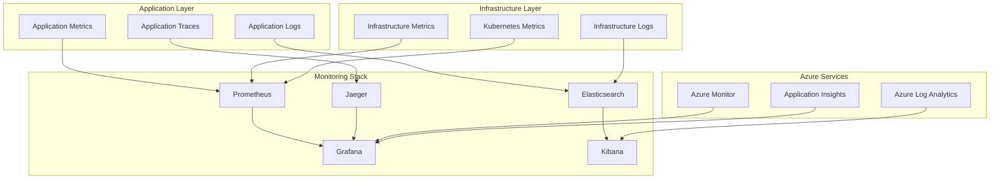

# IntelliVault Monitoring & Observability Architecture

## Overview

IntelliVault implements a comprehensive monitoring and observability architecture that provides real-time insights into system performance, user behavior, and business metrics. The architecture follows the three pillars of observability: metrics, logs, and traces, with additional focus on business intelligence and user experience monitoring.

## Monitoring Strategy

### 1. Observability Pillars

#### Metrics
- **System Metrics**: CPU, memory, disk, network utilization
- **Application Metrics**: Request rates, response times, error rates
- **Business Metrics**: Document uploads, search queries, user engagement
- **Custom Metrics**: AI processing times, embedding generation, entity extraction

#### Logs
- **Application Logs**: Structured JSON logging with correlation IDs
- **Audit Logs**: Security events and user actions
- **System Logs**: Kubernetes and infrastructure logs
- **Error Logs**: Exception tracking and debugging information

#### Traces
- **Distributed Tracing**: End-to-end request tracking across services
- **Performance Profiling**: Function-level performance analysis
- **Dependency Mapping**: Service interaction visualization
- **Bottleneck Identification**: Performance optimization insights

### 2. Monitoring Layers



## Metrics Collection

### Application Metrics
```typescript
import { register, Counter, Histogram, Gauge, collectDefaultMetrics } from 'prom-client';

// Initialize default metrics collection
collectDefaultMetrics({ register });

// Custom application metrics
export const metrics = {
  // Request metrics
  httpRequestsTotal: new Counter({
    name: 'http_requests_total',
    help: 'Total number of HTTP requests',
    labelNames: ['method', 'endpoint', 'status_code', 'tenant_id']
  }),
  
  httpRequestDuration: new Histogram({
    name: 'http_request_duration_seconds',
    help: 'Duration of HTTP requests in seconds',
    labelNames: ['method', 'endpoint', 'tenant_id'],
    buckets: [0.1, 0.5, 1, 2, 5, 10]
  }),
  
  // Business metrics
  documentsUploaded: new Counter({
    name: 'documents_uploaded_total',
    help: 'Total number of documents uploaded',
    labelNames: ['tenant_id', 'mime_type', 'status']
  }),
  
  searchQueriesExecuted: new Counter({
    name: 'search_queries_executed_total',
    help: 'Total number of search queries executed',
    labelNames: ['tenant_id', 'query_type']
  }),
  
  searchQueryDuration: new Histogram({
    name: 'search_query_duration_seconds',
    help: 'Duration of search queries in seconds',
    labelNames: ['tenant_id', 'query_type'],
    buckets: [0.1, 0.5, 1, 2, 5, 10]
  }),
  
  // AI processing metrics
  aiProcessingDuration: new Histogram({
    name: 'ai_processing_duration_seconds',
    help: 'Duration of AI processing tasks in seconds',
    labelNames: ['task_type', 'model', 'tenant_id'],
    buckets: [1, 5, 10, 30, 60, 120, 300]
  }),
  
  embeddingsGenerated: new Counter({
    name: 'embeddings_generated_total',
    help: 'Total number of embeddings generated',
    labelNames: ['model', 'tenant_id']
  }),
  
  entitiesExtracted: new Counter({
    name: 'entities_extracted_total',
    help: 'Total number of entities extracted',
    labelNames: ['entity_type', 'tenant_id']
  }),
  
  // System metrics
  activeConnections: new Gauge({
    name: 'active_connections',
    help: 'Number of active connections',
    labelNames: ['service']
  }),
  
  queueDepth: new Gauge({
    name: 'queue_depth',
    help: 'Current depth of processing queues',
    labelNames: ['queue_name', 'tenant_id']
  }),
  
  // Error metrics
  errorsTotal: new Counter({
    name: 'errors_total',
    help: 'Total number of errors',
    labelNames: ['error_type', 'service', 'tenant_id']
  })
};

// Middleware for automatic metrics collection
export const metricsMiddleware = (req: Request, res: Response, next: NextFunction) => {
  const startTime = Date.now();
  
  res.on('finish', () => {
    const duration = (Date.now() - startTime) / 1000;
    const labels = {
      method: req.method,
      endpoint: req.route?.path || req.path,
      status_code: res.statusCode,
      tenant_id: req.headers['x-tenant-id'] || 'unknown'
    };
    
    metrics.httpRequestsTotal.inc(labels);
    metrics.httpRequestDuration.observe(labels, duration);
    
    if (res.statusCode >= 400) {
      metrics.errorsTotal.inc({
        error_type: 'http_error',
        service: 'api',
        tenant_id: labels.tenant_id
      });
    }
  });
  
  next();
};
```

### Custom Metrics Collection
```typescript
class MetricsCollector {
  async collectDocumentMetrics(document: Document, processingTime: number): Promise<void> {
    const labels = {
      tenant_id: document.tenantId,
      mime_type: document.mimeType,
      status: document.status
    };
    
    metrics.documentsUploaded.inc(labels);
    
    if (document.status === 'completed') {
      metrics.aiProcessingDuration.observe(
        { task_type: 'document_processing', tenant_id: document.tenantId },
        processingTime
      );
    }
  }
  
  async collectSearchMetrics(query: SearchQuery, results: SearchResults): Promise<void> {
    const labels = {
      tenant_id: query.tenantId,
      query_type: this.determineQueryType(query)
    };
    
    metrics.searchQueriesExecuted.inc(labels);
    metrics.searchQueryDuration.observe(labels, results.queryTime / 1000);
  }
  
  async collectAIMetrics(task: AITask, duration: number): Promise<void> {
    const labels = {
      task_type: task.type,
      model: task.model,
      tenant_id: task.tenantId
    };
    
    metrics.aiProcessingDuration.observe(labels, duration);
    
    if (task.type === 'embedding_generation') {
      metrics.embeddingsGenerated.inc({
        model: task.model,
        tenant_id: task.tenantId
      });
    } else if (task.type === 'entity_extraction') {
      metrics.entitiesExtracted.inc({
        entity_type: task.entityType,
        tenant_id: task.tenantId
      });
    }
  }
}
```

## Logging Architecture

### Structured Logging
```typescript
import winston from 'winston';
import { v4 as uuidv4 } from 'uuid';

interface LogContext {
  requestId?: string;
  userId?: string;
  tenantId?: string;
  service?: string;
  operation?: string;
  duration?: number;
  [key: string]: any;
}

class Logger {
  private logger: winston.Logger;
  
  constructor() {
    this.logger = winston.createLogger({
      level: process.env.LOG_LEVEL || 'info',
      format: winston.format.combine(
        winston.format.timestamp(),
        winston.format.errors({ stack: true }),
        winston.format.json(),
        winston.format.printf(({ timestamp, level, message, ...meta }) => {
          return JSON.stringify({
            timestamp,
            level,
            message,
            ...meta
          });
        })
      ),
      transports: [
        new winston.transports.Console(),
        new winston.transports.File({ filename: 'logs/error.log', level: 'error' }),
        new winston.transports.File({ filename: 'logs/combined.log' })
      ]
    });
  }
  
  info(message: string, context: LogContext = {}): void {
    this.logger.info(message, this.enrichContext(context));
  }
  
  error(message: string, error?: Error, context: LogContext = {}): void {
    this.logger.error(message, {
      ...this.enrichContext(context),
      error: error ? {
        message: error.message,
        stack: error.stack,
        name: error.name
      } : undefined
    });
  }
  
  warn(message: string, context: LogContext = {}): void {
    this.logger.warn(message, this.enrichContext(context));
  }
  
  debug(message: string, context: LogContext = {}): void {
    this.logger.debug(message, this.enrichContext(context));
  }
  
  private enrichContext(context: LogContext): LogContext {
    return {
      ...context,
      service: context.service || 'intellivault-api',
      timestamp: new Date().toISOString(),
      version: process.env.APP_VERSION || 'unknown',
      environment: process.env.NODE_ENV || 'development'
    };
  }
}

export const logger = new Logger();
```

### Request Logging Middleware
```typescript
export const requestLoggingMiddleware = (req: Request, res: Response, next: NextFunction) => {
  const requestId = req.headers['x-request-id'] as string || uuidv4();
  const startTime = Date.now();
  
  // Add request ID to headers
  req.headers['x-request-id'] = requestId;
  res.setHeader('x-request-id', requestId);
  
  // Log request
  logger.info('Request started', {
    requestId,
    method: req.method,
    url: req.url,
    userAgent: req.headers['user-agent'],
    ip: req.ip,
    userId: req.user?.id,
    tenantId: req.headers['x-tenant-id']
  });
  
  // Log response
  res.on('finish', () => {
    const duration = Date.now() - startTime;
    
    logger.info('Request completed', {
      requestId,
      method: req.method,
      url: req.url,
      statusCode: res.statusCode,
      duration,
      userId: req.user?.id,
      tenantId: req.headers['x-tenant-id']
    });
  });
  
  next();
};
```

### Audit Logging
```typescript
interface AuditEvent {
  id: string;
  timestamp: Date;
  userId: string;
  tenantId: string;
  action: string;
  resource: string;
  resourceId: string;
  outcome: 'success' | 'failure';
  ipAddress: string;
  userAgent: string;
  metadata: Record<string, any>;
}

class AuditLogger {
  async logEvent(event: Omit<AuditEvent, 'id' | 'timestamp'>): Promise<void> {
    const auditEvent: AuditEvent = {
      id: uuidv4(),
      timestamp: new Date(),
      ...event
    };
    
    // Log to application logs
    logger.info('Audit event', {
      auditEvent,
      type: 'audit'
    });
    
    // Store in dedicated audit store
    await this.storeAuditEvent(auditEvent);
    
    // Send to SIEM system
    await this.sendToSIEM(auditEvent);
  }
  
  async logDocumentAccess(userId: string, tenantId: string, documentId: string, action: string): Promise<void> {
    await this.logEvent({
      userId,
      tenantId,
      action: `document_${action}`,
      resource: 'document',
      resourceId: documentId,
      outcome: 'success',
      ipAddress: req.ip,
      userAgent: req.headers['user-agent'],
      metadata: {
        documentType: 'unknown', // Would be populated from document metadata
        accessMethod: 'api'
      }
    });
  }
}
```

## Distributed Tracing

### Tracing Configuration
```typescript
import { NodeSDK } from '@opentelemetry/sdk-node';
import { getNodeAutoInstrumentations } from '@opentelemetry/auto-instrumentations-node';
import { JaegerExporter } from '@opentelemetry/exporter-jaeger';

const sdk = new NodeSDK({
  traceExporter: new JaegerExporter({
    endpoint: process.env.JAEGER_ENDPOINT || 'http://localhost:14268/api/traces'
  }),
  instrumentations: [
    getNodeAutoInstrumentations({
      '@opentelemetry/instrumentation-fs': {
        enabled: false // Disable file system instrumentation
      }
    })
  ]
});

sdk.start();
```

### Custom Tracing
```typescript
import { trace, context, SpanStatusCode } from '@opentelemetry/api';

const tracer = trace.getTracer('intellivault-api');

class TracedService {
  async processDocument(documentId: string): Promise<void> {
    const span = tracer.startSpan('process_document', {
      attributes: {
        'document.id': documentId,
        'operation.type': 'document_processing'
      }
    });
    
    try {
      await context.with(trace.setSpan(context.active(), span), async () => {
        // Document processing logic
        await this.extractText(documentId);
        await this.generateEmbeddings(documentId);
        await this.updateSearchIndex(documentId);
      });
      
      span.setStatus({ code: SpanStatusCode.OK });
    } catch (error) {
      span.setStatus({
        code: SpanStatusCode.ERROR,
        message: error.message
      });
      span.recordException(error);
      throw error;
    } finally {
      span.end();
    }
  }
  
  private async extractText(documentId: string): Promise<void> {
    const span = tracer.startSpan('extract_text', {
      attributes: {
        'document.id': documentId,
        'operation.type': 'text_extraction'
      }
    });
    
    try {
      // Text extraction logic
      await this.performTextExtraction(documentId);
      span.setStatus({ code: SpanStatusCode.OK });
    } catch (error) {
      span.setStatus({
        code: SpanStatusCode.ERROR,
        message: error.message
      });
      span.recordException(error);
      throw error;
    } finally {
      span.end();
    }
  }
}
```

## Alerting & Notifications

### Alert Rules
```yaml
# Prometheus Alert Rules
groups:
- name: intellivault-alerts
  rules:
  - alert: HighErrorRate
    expr: rate(errors_total[5m]) > 0.1
    for: 2m
    labels:
      severity: warning
    annotations:
      summary: "High error rate detected"
      description: "Error rate is {{ $value }} errors per second"
  
  - alert: HighResponseTime
    expr: histogram_quantile(0.95, rate(http_request_duration_seconds_bucket[5m])) > 2
    for: 5m
    labels:
      severity: warning
    annotations:
      summary: "High response time detected"
      description: "95th percentile response time is {{ $value }} seconds"
  
  - alert: ServiceDown
    expr: up == 0
    for: 1m
    labels:
      severity: critical
    annotations:
      summary: "Service is down"
      description: "Service {{ $labels.instance }} is not responding"
  
  - alert: HighMemoryUsage
    expr: (node_memory_MemTotal_bytes - node_memory_MemAvailable_bytes) / node_memory_MemTotal_bytes > 0.9
    for: 5m
    labels:
      severity: warning
    annotations:
      summary: "High memory usage"
      description: "Memory usage is {{ $value | humanizePercentage }}"
  
  - alert: DiskSpaceLow
    expr: (node_filesystem_avail_bytes / node_filesystem_size_bytes) < 0.1
    for: 5m
    labels:
      severity: critical
    annotations:
      summary: "Low disk space"
      description: "Disk space is {{ $value | humanizePercentage }} available"
```

### Alert Manager Configuration
```yaml
# Alert Manager Configuration
global:
  smtp_smarthost: 'localhost:587'
  smtp_from: 'alerts@intellivault.example.com'

route:
  group_by: ['alertname', 'cluster', 'service']
  group_wait: 10s
  group_interval: 10s
  repeat_interval: 1h
  receiver: 'web.hook'
  routes:
  - match:
      severity: critical
    receiver: 'critical-alerts'
  - match:
      severity: warning
    receiver: 'warning-alerts'

receivers:
- name: 'web.hook'
  webhook_configs:
  - url: 'http://localhost:5001/'

- name: 'critical-alerts'
  email_configs:
  - to: 'oncall@intellivault.example.com'
    subject: 'CRITICAL: {{ .GroupLabels.alertname }}'
    body: |
      {{ range .Alerts }}
      Alert: {{ .Annotations.summary }}
      Description: {{ .Annotations.description }}
      {{ end }}
  slack_configs:
  - api_url: 'https://hooks.slack.com/services/YOUR/SLACK/WEBHOOK'
    channel: '#alerts-critical'
    title: 'Critical Alert'
    text: '{{ range .Alerts }}{{ .Annotations.summary }}{{ end }}'

- name: 'warning-alerts'
  email_configs:
  - to: 'team@intellivault.example.com'
    subject: 'WARNING: {{ .GroupLabels.alertname }}'
    body: |
      {{ range .Alerts }}
      Alert: {{ .Annotations.summary }}
      Description: {{ .Annotations.description }}
      {{ end }}
```

## Dashboard & Visualization

### Grafana Dashboards

#### System Overview Dashboard
```json
{
  "dashboard": {
    "title": "IntelliVault System Overview",
    "panels": [
      {
        "title": "Request Rate",
        "type": "graph",
        "targets": [
          {
            "expr": "rate(http_requests_total[5m])",
            "legendFormat": "{{method}} {{endpoint}}"
          }
        ]
      },
      {
        "title": "Response Time",
        "type": "graph",
        "targets": [
          {
            "expr": "histogram_quantile(0.50, rate(http_request_duration_seconds_bucket[5m]))",
            "legendFormat": "50th percentile"
          },
          {
            "expr": "histogram_quantile(0.95, rate(http_request_duration_seconds_bucket[5m]))",
            "legendFormat": "95th percentile"
          },
          {
            "expr": "histogram_quantile(0.99, rate(http_request_duration_seconds_bucket[5m]))",
            "legendFormat": "99th percentile"
          }
        ]
      },
      {
        "title": "Error Rate",
        "type": "graph",
        "targets": [
          {
            "expr": "rate(errors_total[5m])",
            "legendFormat": "{{error_type}}"
          }
        ]
      },
      {
        "title": "Active Users",
        "type": "singlestat",
        "targets": [
          {
            "expr": "sum(rate(http_requests_total[5m]) * 300)",
            "legendFormat": "Active Users"
          }
        ]
      }
    ]
  }
}
```

#### Business Metrics Dashboard
```json
{
  "dashboard": {
    "title": "IntelliVault Business Metrics",
    "panels": [
      {
        "title": "Documents Uploaded",
        "type": "graph",
        "targets": [
          {
            "expr": "rate(documents_uploaded_total[1h])",
            "legendFormat": "{{tenant_id}}"
          }
        ]
      },
      {
        "title": "Search Queries",
        "type": "graph",
        "targets": [
          {
            "expr": "rate(search_queries_executed_total[1h])",
            "legendFormat": "{{query_type}}"
          }
        ]
      },
      {
        "title": "AI Processing Time",
        "type": "graph",
        "targets": [
          {
            "expr": "histogram_quantile(0.95, rate(ai_processing_duration_seconds_bucket[5m]))",
            "legendFormat": "{{task_type}}"
          }
        ]
      },
      {
        "title": "Embeddings Generated",
        "type": "singlestat",
        "targets": [
          {
            "expr": "sum(rate(embeddings_generated_total[1h]))",
            "legendFormat": "Embeddings/hour"
          }
        ]
      }
    ]
  }
}
```

### Custom Monitoring Scripts
```typescript
class HealthChecker {
  async checkSystemHealth(): Promise<HealthStatus> {
    const checks = await Promise.allSettled([
      this.checkDatabase(),
      this.checkSearchService(),
      this.checkBlobStorage(),
      this.checkOpenAI(),
      this.checkRedis(),
      this.checkQueueHealth()
    ]);
    
    const results: HealthCheckResult[] = checks.map((result, index) => {
      const service = this.getServiceName(index);
      return {
        service,
        status: result.status === 'fulfilled' ? 'healthy' : 'unhealthy',
        responseTime: result.status === 'fulfilled' ? result.value : null,
        error: result.status === 'rejected' ? result.reason.message : null
      };
    });
    
    const overallStatus = results.every(r => r.status === 'healthy') ? 'healthy' : 'unhealthy';
    
    return {
      status: overallStatus,
      timestamp: new Date().toISOString(),
      checks: results,
      uptime: process.uptime(),
      version: process.env.APP_VERSION || 'unknown'
    };
  }
  
  private async checkDatabase(): Promise<number> {
    const start = Date.now();
    await this.cosmosClient.getDatabaseAccount();
    return Date.now() - start;
  }
  
  private async checkSearchService(): Promise<number> {
    const start = Date.now();
    await this.searchClient.getServiceStatistics();
    return Date.now() - start;
  }
  
  private async checkOpenAI(): Promise<number> {
    const start = Date.now();
    await this.openai.models.list();
    return Date.now() - start;
  }
}
```

## Performance Monitoring

### Application Performance Monitoring (APM)
```typescript
class PerformanceMonitor {
  private performanceEntries: PerformanceEntry[] = [];
  
  async measureOperation<T>(
    operationName: string,
    operation: () => Promise<T>
  ): Promise<T> {
    const startTime = performance.now();
    
    try {
      const result = await operation();
      const endTime = performance.now();
      const duration = endTime - startTime;
      
      this.recordPerformanceEntry({
        name: operationName,
        startTime,
        duration,
        success: true
      });
      
      return result;
    } catch (error) {
      const endTime = performance.now();
      const duration = endTime - startTime;
      
      this.recordPerformanceEntry({
        name: operationName,
        startTime,
        duration,
        success: false,
        error: error.message
      });
      
      throw error;
    }
  }
  
  private recordPerformanceEntry(entry: PerformanceEntry): void {
    this.performanceEntries.push(entry);
    
    // Send to monitoring system
    this.sendToMonitoring(entry);
    
    // Keep only recent entries in memory
    if (this.performanceEntries.length > 1000) {
      this.performanceEntries = this.performanceEntries.slice(-500);
    }
  }
  
  getPerformanceStats(): PerformanceStats {
    const successful = this.performanceEntries.filter(e => e.success);
    const failed = this.performanceEntries.filter(e => !e.success);
    
    return {
      totalOperations: this.performanceEntries.length,
      successfulOperations: successful.length,
      failedOperations: failed.length,
      successRate: successful.length / this.performanceEntries.length,
      averageDuration: successful.reduce((sum, e) => sum + e.duration, 0) / successful.length,
      p95Duration: this.calculatePercentile(successful.map(e => e.duration), 95),
      p99Duration: this.calculatePercentile(successful.map(e => e.duration), 99)
    };
  }
}
```

## User Experience Monitoring

### Real User Monitoring (RUM)
```typescript
class UserExperienceMonitor {
  async trackUserInteraction(
    userId: string,
    tenantId: string,
    interaction: UserInteraction
  ): Promise<void> {
    const event = {
      userId,
      tenantId,
      timestamp: new Date(),
      interaction,
      sessionId: this.getSessionId(userId),
      userAgent: this.getUserAgent(),
      viewport: this.getViewportSize(),
      connectionType: this.getConnectionType()
    };
    
    // Send to analytics service
    await this.sendToAnalytics(event);
    
    // Store for real-time analysis
    await this.storeUserEvent(event);
  }
  
  async trackPageLoad(
    userId: string,
    tenantId: string,
    pageLoadMetrics: PageLoadMetrics
  ): Promise<void> {
    const event = {
      userId,
      tenantId,
      timestamp: new Date(),
      type: 'page_load',
      metrics: pageLoadMetrics
    };
    
    await this.sendToAnalytics(event);
  }
  
  async trackSearchQuery(
    userId: string,
    tenantId: string,
    searchMetrics: SearchMetrics
  ): Promise<void> {
    const event = {
      userId,
      tenantId,
      timestamp: new Date(),
      type: 'search_query',
      metrics: searchMetrics
    };
    
    await this.sendToAnalytics(event);
  }
}
```

---

**Document Version**: 1.0  
**Last Updated**: January 2025  
**Next Review**: March 2025
