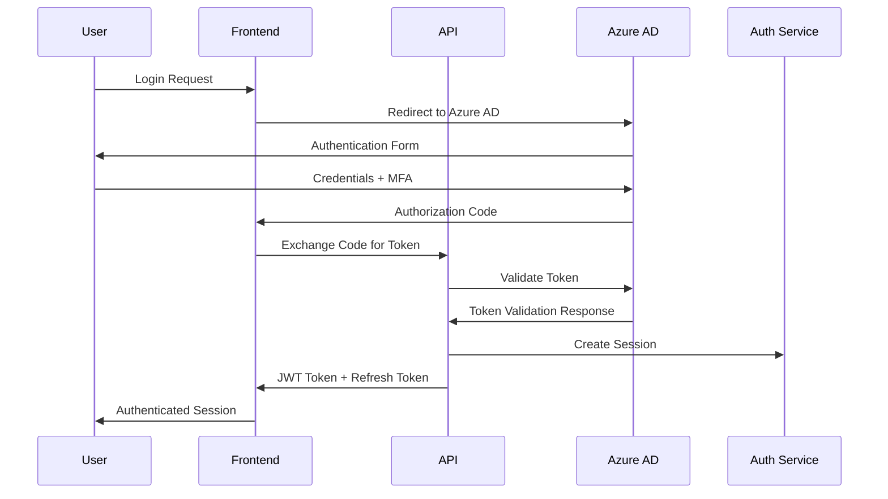

# IntelliVault Security Architecture

## Overview

IntelliVault implements a comprehensive security architecture that follows defense-in-depth principles, ensuring protection at every layer of the application stack. The security model addresses authentication, authorization, data protection, network security, and compliance requirements.

## Security Principles

### 1. Defense in Depth
- **Multiple Security Layers**: Security controls at network, application, and data layers
- **Fail-Safe Defaults**: Secure by default configuration
- **Principle of Least Privilege**: Minimal necessary access permissions
- **Zero Trust Architecture**: Verify every request and transaction

### 2. Data Protection
- **Encryption at Rest**: AES-256 encryption for all stored data
- **Encryption in Transit**: TLS 1.3 for all communications
- **Data Classification**: Sensitive data identification and handling
- **Data Loss Prevention**: Automated detection and prevention

### 3. Identity & Access Management
- **Multi-Factor Authentication**: Required for all administrative access
- **Role-Based Access Control**: Granular permissions based on user roles
- **Single Sign-On**: Integration with Azure Active Directory
- **Session Management**: Secure session handling and timeout

## Authentication & Authorization

### Authentication Flow


### JWT Token Structure
```json
{
  "header": {
    "alg": "RS256",
    "typ": "JWT",
    "kid": "key-id"
  },
  "payload": {
    "sub": "user_123",
    "tenant_id": "tenant_456",
    "email": "user@example.com",
    "role": "admin",
    "permissions": [
      "documents:read",
      "documents:write",
      "search:read",
      "admin:all"
    ],
    "iat": 1640995200,
    "exp": 1640998800,
    "iss": "https://login.microsoftonline.com/{tenant-id}/v2.0",
    "aud": "api://intellivault"
  }
}
```

### Role-Based Access Control
```typescript
enum Permission {
  // Document permissions
  DOCUMENTS_READ = 'documents:read',
  DOCUMENTS_WRITE = 'documents:write',
  DOCUMENTS_DELETE = 'documents:delete',
  DOCUMENTS_ADMIN = 'documents:admin',
  
  // Search permissions
  SEARCH_READ = 'search:read',
  SEARCH_ADVANCED = 'search:advanced',
  
  // Analytics permissions
  ANALYTICS_READ = 'analytics:read',
  ANALYTICS_EXPORT = 'analytics:export',
  
  // Administrative permissions
  USERS_MANAGE = 'users:manage',
  TENANTS_MANAGE = 'tenants:manage',
  SYSTEM_ADMIN = 'system:admin'
}

enum Role {
  VIEWER = 'viewer',
  USER = 'user',
  POWER_USER = 'power_user',
  ADMIN = 'admin',
  SUPER_ADMIN = 'super_admin'
}

const rolePermissions: Record<Role, Permission[]> = {
  [Role.VIEWER]: [
    Permission.DOCUMENTS_READ,
    Permission.SEARCH_READ
  ],
  [Role.USER]: [
    Permission.DOCUMENTS_READ,
    Permission.DOCUMENTS_WRITE,
    Permission.SEARCH_READ,
    Permission.SEARCH_ADVANCED
  ],
  [Role.POWER_USER]: [
    ...rolePermissions[Role.USER],
    Permission.ANALYTICS_READ,
    Permission.ANALYTICS_EXPORT
  ],
  [Role.ADMIN]: [
    ...rolePermissions[Role.POWER_USER],
    Permission.USERS_MANAGE,
    Permission.TENANTS_MANAGE
  ],
  [Role.SUPER_ADMIN]: [
    ...rolePermissions[Role.ADMIN],
    Permission.SYSTEM_ADMIN
  ]
};
```

### Authorization Middleware
```typescript
export const requirePermission = (permission: Permission) => {
  return (req: AuthenticatedRequest, res: Response, next: NextFunction) => {
    const userPermissions = req.user.permissions;
    
    if (!userPermissions.includes(permission)) {
      res.status(403).json({
        success: false,
        error: {
          code: 'FORBIDDEN',
          message: 'Insufficient permissions',
          required_permission: permission
        }
      });
      return;
    }
    
    next();
  };
};

export const requireRole = (allowedRoles: Role[]) => {
  return (req: AuthenticatedRequest, res: Response, next: NextFunction) => {
    const userRole = req.user.role;
    
    if (!allowedRoles.includes(userRole)) {
      res.status(403).json({
        success: false,
        error: {
          code: 'FORBIDDEN',
          message: 'Insufficient role privileges',
          required_roles: allowedRoles
        }
      });
      return;
    }
    
    next();
  };
};
```

## Data Security

### Encryption Strategy

#### Data at Rest
```typescript
class DataEncryption {
  private readonly algorithm = 'aes-256-gcm';
  private readonly keyLength = 32;
  
  async encryptData(data: Buffer, key: Buffer): Promise<EncryptedData> {
    const iv = crypto.randomBytes(16);
    const cipher = crypto.createCipher(this.algorithm, key);
    cipher.setAAD(Buffer.from('intellivault'));
    
    let encrypted = cipher.update(data);
    encrypted = Buffer.concat([encrypted, cipher.final()]);
    
    const authTag = cipher.getAuthTag();
    
    return {
      encrypted,
      iv,
      authTag,
      algorithm: this.algorithm
    };
  }
  
  async decryptData(encryptedData: EncryptedData, key: Buffer): Promise<Buffer> {
    const decipher = crypto.createDecipher(encryptedData.algorithm, key);
    decipher.setAAD(Buffer.from('intellivault'));
    decipher.setAuthTag(encryptedData.authTag);
    
    let decrypted = decipher.update(encryptedData.encrypted);
    decrypted = Buffer.concat([decrypted, decipher.final()]);
    
    return decrypted;
  }
}
```

#### Data in Transit
```typescript
class TransportSecurity {
  private readonly tlsOptions = {
    minVersion: 'TLSv1.3',
    ciphers: [
      'TLS_AES_256_GCM_SHA384',
      'TLS_CHACHA20_POLY1305_SHA256',
      'TLS_AES_128_GCM_SHA256'
    ].join(':'),
    honorCipherOrder: true,
    secureProtocol: 'TLSv1_3_method'
  };
  
  configureHTTPS(app: Express): void {
    app.use(helmet({
      contentSecurityPolicy: {
        directives: {
          defaultSrc: ["'self'"],
          styleSrc: ["'self'", "'unsafe-inline'"],
          scriptSrc: ["'self'"],
          imgSrc: ["'self'", "data:", "https:"],
          connectSrc: ["'self'"],
          fontSrc: ["'self'"],
          objectSrc: ["'none'"],
          mediaSrc: ["'self'"],
          frameSrc: ["'none'"]
        }
      },
      hsts: {
        maxAge: 31536000,
        includeSubDomains: true,
        preload: true
      }
    }));
  }
}
```

### Data Classification
```typescript
enum DataClassification {
  PUBLIC = 'public',
  INTERNAL = 'internal',
  CONFIDENTIAL = 'confidential',
  RESTRICTED = 'restricted'
}

interface DataClassificationPolicy {
  classification: DataClassification;
  encryptionRequired: boolean;
  accessControls: Permission[];
  retentionPeriod: number; // days
  auditRequired: boolean;
}

const dataClassificationPolicies: Record<string, DataClassificationPolicy> = {
  'user_profile': {
    classification: DataClassification.CONFIDENTIAL,
    encryptionRequired: true,
    accessControls: [Permission.USERS_MANAGE],
    retentionPeriod: 2555, // 7 years
    auditRequired: true
  },
  'document_content': {
    classification: DataClassification.RESTRICTED,
    encryptionRequired: true,
    accessControls: [Permission.DOCUMENTS_READ],
    retentionPeriod: 3650, // 10 years
    auditRequired: true
  },
  'search_queries': {
    classification: DataClassification.INTERNAL,
    encryptionRequired: false,
    accessControls: [Permission.SEARCH_READ],
    retentionPeriod: 365, // 1 year
    auditRequired: false
  }
};
```

### Data Loss Prevention
```typescript
class DataLossPrevention {
  async scanDocument(content: string): Promise<DLPResult> {
    const patterns = {
      ssn: /\b\d{3}-\d{2}-\d{4}\b/g,
      creditCard: /\b\d{4}[-\s]?\d{4}[-\s]?\d{4}[-\s]?\d{4}\b/g,
      email: /\b[A-Za-z0-9._%+-]+@[A-Za-z0-9.-]+\.[A-Z|a-z]{2,}\b/g,
      phone: /\b\d{3}[-.]?\d{3}[-.]?\d{4}\b/g
    };
    
    const violations: DLPViolation[] = [];
    
    for (const [type, pattern] of Object.entries(patterns)) {
      const matches = content.match(pattern);
      if (matches) {
        violations.push({
          type,
          matches: matches.length,
          severity: this.getSeverity(type),
          locations: this.getMatchLocations(content, pattern)
        });
      }
    }
    
    return {
      hasViolations: violations.length > 0,
      violations,
      riskScore: this.calculateRiskScore(violations)
    };
  }
  
  private getSeverity(type: string): 'low' | 'medium' | 'high' | 'critical' {
    const severityMap = {
      'ssn': 'critical',
      'creditCard': 'high',
      'email': 'medium',
      'phone': 'low'
    };
    return severityMap[type] || 'low';
  }
}
```

## Network Security

### Network Segmentation
```yaml
# Network Policies
apiVersion: networking.k8s.io/v1
kind: NetworkPolicy
metadata:
  name: intellivault-backend-policy
  namespace: intellivault-prod
spec:
  podSelector:
    matchLabels:
      app: intellivault-backend
  policyTypes:
  - Ingress
  - Egress
  ingress:
  - from:
    - namespaceSelector:
        matchLabels:
          name: ingress-nginx
    - podSelector:
        matchLabels:
          app: intellivault-frontend
    ports:
    - protocol: TCP
      port: 3000
  egress:
  - to:
    - namespaceSelector:
        matchLabels:
          name: intellivault-prod
    ports:
    - protocol: TCP
      port: 6379  # Redis
    - protocol: TCP
      port: 5432  # Database (if applicable)
  - to: []
    ports:
    - protocol: TCP
      port: 443   # HTTPS to Azure services
    - protocol: UDP
      port: 53    # DNS
```

### Private Endpoints
```typescript
class PrivateEndpointConfig {
  private endpoints = [
    {
      service: 'cosmos-db',
      endpoint: 'https://intellivault-cosmos.privatelink.documents.azure.com',
      vnet: 'intellivault-vnet',
      subnet: 'private-endpoints'
    },
    {
      service: 'blob-storage',
      endpoint: 'https://intellivaultstorage.privatelink.blob.core.windows.net',
      vnet: 'intellivault-vnet',
      subnet: 'private-endpoints'
    },
    {
      service: 'ai-search',
      endpoint: 'https://intellivault-search.privatelink.search.windows.net',
      vnet: 'intellivault-vnet',
      subnet: 'private-endpoints'
    },
    {
      service: 'openai',
      endpoint: 'https://intellivault-openai.privatelink.openai.azure.com',
      vnet: 'intellivault-vnet',
      subnet: 'private-endpoints'
    }
  ];
  
  async configurePrivateEndpoints(): Promise<void> {
    for (const endpoint of this.endpoints) {
      await this.createPrivateEndpoint(endpoint);
    }
  }
}
```

### Web Application Firewall
```yaml
# WAF Configuration
apiVersion: networking.k8s.io/v1
kind: Ingress
metadata:
  name: intellivault-waf
  namespace: intellivault-prod
  annotations:
    kubernetes.io/ingress.class: "azure/application-gateway"
    appgw.ingress.kubernetes.io/waf-policy: "intellivault-waf-policy"
    appgw.ingress.kubernetes.io/ssl-redirect: "true"
    appgw.ingress.kubernetes.io/backend-protocol: "http"
spec:
  tls:
  - hosts:
    - api.intellivault.example.com
    - app.intellivault.example.com
    secretName: intellivault-tls
  rules:
  - host: api.intellivault.example.com
    http:
      paths:
      - path: /
        pathType: Prefix
        backend:
          service:
            name: intellivault-backend
            port:
              number: 3000
```

## Application Security

### Input Validation & Sanitization
```typescript
import { z } from 'zod';
import DOMPurify from 'dompurify';
import { JSDOM } from 'jsdom';

class InputValidator {
  private window = new JSDOM('').window;
  private purify = DOMPurify(this.window as any);
  
  validateAndSanitize(input: any, schema: z.ZodSchema): any {
    // Validate against schema
    const validated = schema.parse(input);
    
    // Sanitize string inputs
    if (typeof validated === 'string') {
      return this.purify.sanitize(validated);
    }
    
    if (typeof validated === 'object' && validated !== null) {
      return this.sanitizeObject(validated);
    }
    
    return validated;
  }
  
  private sanitizeObject(obj: any): any {
    const sanitized: any = {};
    
    for (const [key, value] of Object.entries(obj)) {
      if (typeof value === 'string') {
        sanitized[key] = this.purify.sanitize(value);
      } else if (typeof value === 'object' && value !== null) {
        sanitized[key] = this.sanitizeObject(value);
      } else {
        sanitized[key] = value;
      }
    }
    
    return sanitized;
  }
}
```

### SQL Injection Prevention
```typescript
class SecureDatabase {
  async query(query: string, parameters: any[]): Promise<any[]> {
    // Use parameterized queries
    const sanitizedQuery = this.sanitizeQuery(query);
    const sanitizedParams = parameters.map(param => this.sanitizeParameter(param));
    
    return this.executeQuery(sanitizedQuery, sanitizedParams);
  }
  
  private sanitizeQuery(query: string): string {
    // Remove dangerous SQL keywords
    const dangerousKeywords = [
      'DROP', 'DELETE', 'INSERT', 'UPDATE', 'ALTER', 'CREATE',
      'EXEC', 'EXECUTE', 'UNION', 'SELECT', 'FROM', 'WHERE'
    ];
    
    let sanitized = query;
    for (const keyword of dangerousKeywords) {
      const regex = new RegExp(`\\b${keyword}\\b`, 'gi');
      sanitized = sanitized.replace(regex, '');
    }
    
    return sanitized;
  }
  
  private sanitizeParameter(param: any): any {
    if (typeof param === 'string') {
      return param.replace(/['";\\]/g, '');
    }
    return param;
  }
}
```

### Cross-Site Scripting (XSS) Prevention
```typescript
class XSSProtection {
  private cspDirectives = {
    'default-src': ["'self'"],
    'script-src': ["'self'", "'unsafe-inline'"],
    'style-src': ["'self'", "'unsafe-inline'"],
    'img-src': ["'self'", "data:", "https:"],
    'font-src': ["'self'"],
    'connect-src': ["'self'"],
    'frame-ancestors': ["'none'"],
    'base-uri': ["'self'"],
    'form-action': ["'self'"]
  };
  
  configureCSP(app: Express): void {
    app.use(helmet.contentSecurityPolicy({
      directives: this.cspDirectives
    }));
  }
  
  sanitizeOutput(output: string): string {
    return output
      .replace(/</g, '&lt;')
      .replace(/>/g, '&gt;')
      .replace(/"/g, '&quot;')
      .replace(/'/g, '&#x27;')
      .replace(/\//g, '&#x2F;');
  }
}
```

## Audit & Compliance

### Audit Logging
```typescript
interface AuditEvent {
  id: string;
  timestamp: Date;
  userId: string;
  tenantId: string;
  action: string;
  resource: string;
  resourceId: string;
  outcome: 'success' | 'failure';
  ipAddress: string;
  userAgent: string;
  metadata: Record<string, any>;
}

class AuditLogger {
  async logEvent(event: Omit<AuditEvent, 'id' | 'timestamp'>): Promise<void> {
    const auditEvent: AuditEvent = {
      id: generateId(),
      timestamp: new Date(),
      ...event
    };
    
    // Store in audit database
    await this.storeAuditEvent(auditEvent);
    
    // Send to SIEM system
    await this.sendToSIEM(auditEvent);
    
    // Check for suspicious patterns
    await this.analyzeForThreats(auditEvent);
  }
  
  private async analyzeForThreats(event: AuditEvent): Promise<void> {
    const suspiciousPatterns = [
      'multiple_failed_logins',
      'unusual_access_patterns',
      'privilege_escalation_attempts',
      'data_exfiltration_indicators'
    ];
    
    for (const pattern of suspiciousPatterns) {
      if (await this.detectPattern(event, pattern)) {
        await this.triggerSecurityAlert(event, pattern);
      }
    }
  }
}
```

### Compliance Framework
```typescript
enum ComplianceStandard {
  GDPR = 'GDPR',
  HIPAA = 'HIPAA',
  SOC2 = 'SOC2',
  ISO27001 = 'ISO27001',
  PCI_DSS = 'PCI_DSS'
}

class ComplianceManager {
  private requirements: Record<ComplianceStandard, ComplianceRequirement[]> = {
    [ComplianceStandard.GDPR]: [
      { id: 'data_minimization', description: 'Collect only necessary data' },
      { id: 'consent_management', description: 'Obtain explicit consent' },
      { id: 'right_to_erasure', description: 'Support data deletion requests' },
      { id: 'data_portability', description: 'Enable data export' },
      { id: 'privacy_by_design', description: 'Build privacy into architecture' }
    ],
    [ComplianceStandard.HIPAA]: [
      { id: 'access_controls', description: 'Implement role-based access' },
      { id: 'audit_logging', description: 'Log all access to PHI' },
      { id: 'encryption', description: 'Encrypt PHI at rest and in transit' },
      { id: 'business_associate_agreement', description: 'BAA with service providers' },
      { id: 'incident_response', description: 'Breach notification procedures' }
    ]
  };
  
  async validateCompliance(standard: ComplianceStandard): Promise<ComplianceReport> {
    const requirements = this.requirements[standard];
    const results: ComplianceCheck[] = [];
    
    for (const requirement of requirements) {
      const result = await this.checkRequirement(requirement);
      results.push(result);
    }
    
    return {
      standard,
      timestamp: new Date(),
      overallCompliance: this.calculateOverallCompliance(results),
      checks: results
    };
  }
}
```

## Incident Response

### Security Incident Response Plan
```typescript
enum IncidentSeverity {
  LOW = 'low',
  MEDIUM = 'medium',
  HIGH = 'high',
  CRITICAL = 'critical'
}

interface SecurityIncident {
  id: string;
  severity: IncidentSeverity;
  type: string;
  description: string;
  detectedAt: Date;
  status: 'open' | 'investigating' | 'contained' | 'resolved';
  affectedSystems: string[];
  affectedUsers: string[];
  evidence: Evidence[];
  remediation: RemediationAction[];
}

class IncidentResponseManager {
  async handleSecurityIncident(incident: SecurityIncident): Promise<void> {
    // Immediate response based on severity
    switch (incident.severity) {
      case IncidentSeverity.CRITICAL:
        await this.activateEmergencyResponse(incident);
        break;
      case IncidentSeverity.HIGH:
        await this.activateHighPriorityResponse(incident);
        break;
      default:
        await this.activateStandardResponse(incident);
    }
    
    // Notify stakeholders
    await this.notifyStakeholders(incident);
    
    // Begin investigation
    await this.startInvestigation(incident);
  }
  
  private async activateEmergencyResponse(incident: SecurityIncident): Promise<void> {
    // Immediate containment actions
    await this.isolateAffectedSystems(incident.affectedSystems);
    await this.revokeCompromisedCredentials(incident.affectedUsers);
    await this.activateIncidentResponseTeam();
  }
}
```

## Security Monitoring

### Threat Detection
```typescript
class ThreatDetector {
  async detectThreats(auditEvents: AuditEvent[]): Promise<Threat[]> {
    const threats: Threat[] = [];
    
    // Brute force detection
    const bruteForceThreats = await this.detectBruteForce(auditEvents);
    threats.push(...bruteForceThreats);
    
    // Unusual access pattern detection
    const accessPatternThreats = await this.detectUnusualAccess(auditEvents);
    threats.push(...accessPatternThreats);
    
    // Data exfiltration detection
    const exfiltrationThreats = await this.detectDataExfiltration(auditEvents);
    threats.push(...exfiltrationThreats);
    
    return threats;
  }
  
  private async detectBruteForce(events: AuditEvent[]): Promise<Threat[]> {
    const loginFailures = events.filter(e => 
      e.action === 'login' && e.outcome === 'failure'
    );
    
    const failuresByUser = this.groupBy(loginFailures, 'userId');
    const threats: Threat[] = [];
    
    for (const [userId, failures] of Object.entries(failuresByUser)) {
      if (failures.length > 5) { // Threshold for brute force
        threats.push({
          type: 'brute_force_attack',
          severity: 'high',
          description: `Multiple failed login attempts for user ${userId}`,
          evidence: failures,
          recommendation: 'Lock user account and investigate'
        });
      }
    }
    
    return threats;
  }
}
```

---

**Document Version**: 1.0  
**Last Updated**: January 2025  
**Next Review**: March 2025
