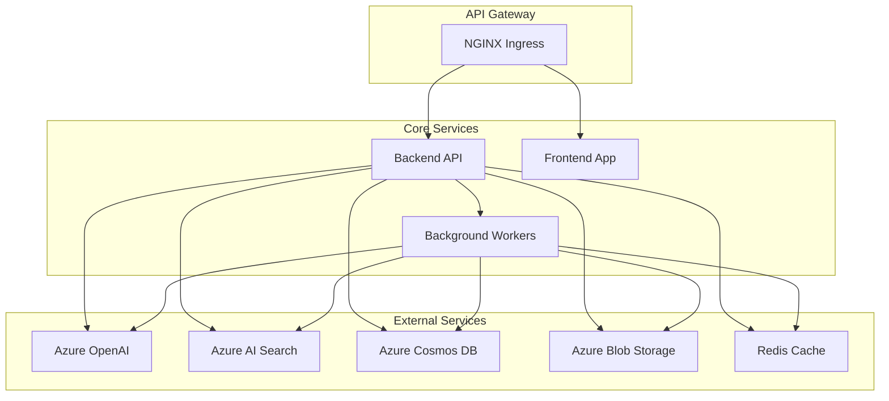
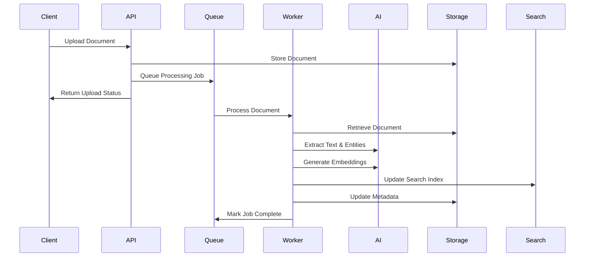
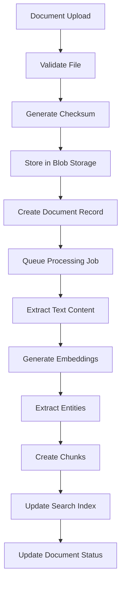
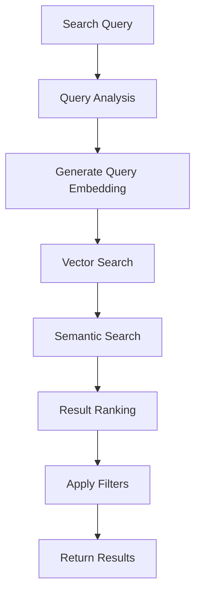
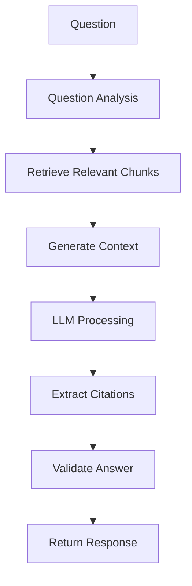

# IntelliVault System Design

## Table of Contents

1. [System Components](#system-components)
2. [Service Architecture](#service-architecture)
3. [Data Architecture](#data-architecture)
4. [Processing Pipeline](#processing-pipeline)
5. [Integration Patterns](#integration-patterns)
6. [Scalability Design](#scalability-design)
7. [Reliability & Fault Tolerance](#reliability--fault-tolerance)
8. [Performance Design](#performance-design)

## System Components

### 1. Application Layer

#### Backend API Service
```typescript
// Core service structure
class IntelliVaultAPI {
  // Authentication & Authorization
  authMiddleware: JWTValidation
  rbacMiddleware: RoleBasedAccessControl
  
  // Core endpoints
  documentsAPI: DocumentManagementAPI
  searchAPI: SearchAPI
  qaAPI: QuestionAnsweringAPI
  graphAPI: KnowledgeGraphAPI
  
  // Middleware
  errorHandler: GlobalErrorHandler
  loggingMiddleware: RequestLogging
  securityMiddleware: SecurityHeaders
}
```

**Responsibilities:**
- Handle HTTP requests and responses
- Authentication and authorization
- Input validation and sanitization
- Business logic orchestration
- Response formatting and error handling

**Key Endpoints:**
- `GET /v1/documents` - List documents
- `POST /v1/documents` - Upload documents
- `GET /v1/search` - Semantic search
- `POST /v1/qa` - Question answering
- `GET /v1/graph` - Knowledge graph exploration

#### Background Workers
```typescript
// Worker service structure
class DocumentProcessingWorker {
  queueManager: BullMQQueueManager
  processors: {
    textExtractor: TextExtractionProcessor
    entityExtractor: EntityExtractionProcessor
    embeddingGenerator: EmbeddingGenerationProcessor
    indexer: SearchIndexingProcessor
  }
  
  jobTypes: {
    documentIngestion: DocumentIngestionJob
    reindexing: ReindexingJob
    cleanup: CleanupJob
  }
}
```

**Responsibilities:**
- Asynchronous document processing
- AI model inference
- Search index updates
- Data cleanup and maintenance
- Batch processing operations

#### Frontend Application
```typescript
// Frontend architecture
class IntelliVaultFrontend {
  components: {
    documentUploader: DocumentUploadComponent
    searchInterface: SearchInterfaceComponent
    graphVisualizer: KnowledgeGraphComponent
    dashboard: AnalyticsDashboardComponent
  }
  
  services: {
    apiClient: ApiClientService
    authService: AuthenticationService
    stateManager: ApplicationStateManager
  }
  
  routing: ReactRouterConfiguration
}
```

**Responsibilities:**
- User interface and experience
- Client-side state management
- API communication
- Authentication flow
- Real-time updates via WebSocket

### 2. Data Layer

#### Azure Cosmos DB (Operational Data)
```json
{
  "users": {
    "id": "user_123",
    "email": "user@example.com",
    "tenant_id": "tenant_456",
    "role": "admin",
    "permissions": ["read", "write", "admin"],
    "created_at": "2025-01-01T00:00:00Z"
  },
  "documents": {
    "id": "doc_789",
    "tenant_id": "tenant_456",
    "filename": "contract.pdf",
    "mime_type": "application/pdf",
    "size_bytes": 1024000,
    "status": "processed",
    "metadata": {...},
    "created_at": "2025-01-01T00:00:00Z"
  },
  "audit_logs": {
    "id": "audit_001",
    "user_id": "user_123",
    "action": "document_upload",
    "resource_id": "doc_789",
    "timestamp": "2025-01-01T00:00:00Z",
    "details": {...}
  }
}
```

**Use Cases:**
- User management and authentication
- Document metadata and status tracking
- Audit logs and compliance tracking
- Application configuration
- Session management

#### Azure Blob Storage (Document Storage)
```
intellivault-storage/
├── tenants/
│   ├── tenant_456/
│   │   ├── documents/
│   │   │   ├── 2025/01/01/doc_789.pdf
│   │   │   └── 2025/01/01/doc_790.docx
│   │   └── processing/
│   │       └── temp_uploads/
│   └── tenant_789/
└── shared/
    └── templates/
```

**Use Cases:**
- Original document storage
- Temporary upload processing
- Backup and archival
- Static assets and templates
- Processing artifacts

#### Azure AI Search (Search Indexes)
```json
{
  "indexes": {
    "documents": {
      "fields": {
        "id": "string",
        "tenant_id": "string",
        "title": "searchable",
        "content": "searchable",
        "entities": "collection(string)",
        "embedding": "vector",
        "metadata": "object",
        "created_at": "datetime"
      },
      "scoringProfiles": ["semantic", "vector"],
      "suggesters": ["title", "entities"]
    },
    "entities": {
      "fields": {
        "id": "string",
        "type": "string",
        "name": "searchable",
        "aliases": "collection(string)",
        "relationships": "collection(string)",
        "embedding": "vector"
      }
    }
  }
}
```

**Use Cases:**
- Semantic and vector search
- Full-text search capabilities
- Faceted search and filtering
- Auto-complete and suggestions
- Relevance scoring and ranking

#### Redis Cache
```typescript
// Cache key patterns
const cacheKeys = {
  userSession: (userId: string) => `session:${userId}`,
  searchResults: (query: string, tenant: string) => `search:${tenant}:${hash(query)}`,
  documentMetadata: (docId: string) => `doc:${docId}`,
  apiRateLimit: (userId: string, endpoint: string) => `rate:${userId}:${endpoint}`,
  embeddings: (text: string) => `embedding:${hash(text)}`
};
```

**Use Cases:**
- Session management
- Search result caching
- API rate limiting
- Embedding caching
- Temporary data storage

### 3. AI Services Layer

#### Azure OpenAI Integration
```typescript
class OpenAIService {
  // Text processing
  async generateEmbedding(text: string): Promise<number[]>
  async extractEntities(text: string): Promise<Entity[]>
  async summarizeDocument(content: string): Promise<string>
  async answerQuestion(question: string, context: string[]): Promise<Answer>
  
  // Model configuration
  embeddingModel: "text-embedding-3-large"
  chatModel: "gpt-4o"
  maxTokens: 4000
  temperature: 0.1
}
```

**Models Used:**
- `text-embedding-3-large`: Document and query vectorization
- `gpt-4o`: Question answering and summarization
- `gpt-4o-mini`: Lightweight processing tasks

## Service Architecture

### 1. Microservices Design



### 2. Service Communication Patterns

#### Synchronous Communication
- **HTTP/REST**: API-to-API communication
- **GraphQL**: Efficient data fetching (future consideration)
- **gRPC**: High-performance service communication (future consideration)

#### Asynchronous Communication
- **Message Queues**: BullMQ with Redis for job processing
- **Event Streaming**: Azure Service Bus for event-driven architecture
- **WebSockets**: Real-time updates to frontend

#### Service Discovery
- **Kubernetes DNS**: Automatic service discovery within cluster
- **Load Balancing**: NGINX ingress for external traffic
- **Health Checks**: Kubernetes liveness and readiness probes

### 3. Data Flow Architecture



## Data Architecture

### 1. Data Models

#### Document Model
```typescript
interface Document {
  id: string;
  tenant_id: string;
  filename: string;
  mime_type: string;
  size_bytes: number;
  checksum: string;
  status: 'uploading' | 'processing' | 'completed' | 'failed';
  metadata: {
    title?: string;
    author?: string;
    created_date?: Date;
    language?: string;
    page_count?: number;
  };
  processing: {
    started_at?: Date;
    completed_at?: Date;
    error_message?: string;
    chunks_count?: number;
    entities_count?: number;
  };
  created_at: Date;
  updated_at: Date;
}
```

#### Document Chunk Model
```typescript
interface DocumentChunk {
  id: string;
  document_id: string;
  tenant_id: string;
  chunk_index: number;
  content: string;
  embedding: number[];
  entities: Entity[];
  metadata: {
    page_number?: number;
    section_title?: string;
    confidence_score: number;
  };
  created_at: Date;
}
```

#### Entity Model
```typescript
interface Entity {
  id: string;
  tenant_id: string;
  type: 'PERSON' | 'ORGANIZATION' | 'LOCATION' | 'DATE' | 'MONEY' | 'CONCEPT';
  name: string;
  aliases: string[];
  description?: string;
  relationships: EntityRelationship[];
  metadata: {
    confidence_score: number;
    source_chunks: string[];
    first_mentioned: Date;
    last_mentioned: Date;
  };
  created_at: Date;
  updated_at: Date;
}
```

#### User Model
```typescript
interface User {
  id: string;
  tenant_id: string;
  email: string;
  role: 'admin' | 'user' | 'viewer';
  permissions: Permission[];
  profile: {
    first_name: string;
    last_name: string;
    department?: string;
    timezone: string;
  };
  preferences: {
    search_defaults: SearchPreferences;
    notifications: NotificationSettings;
  };
  created_at: Date;
  last_login: Date;
  status: 'active' | 'suspended' | 'pending';
}
```

### 2. Data Partitioning Strategy

#### Cosmos DB Partitioning
```typescript
// Partition key strategy
const partitionKeys = {
  users: 'tenant_id',           // Users partitioned by tenant
  documents: 'tenant_id',       // Documents partitioned by tenant
  audit_logs: 'tenant_id',      // Audit logs partitioned by tenant
  entities: 'tenant_id',        // Entities partitioned by tenant
  chunks: 'document_id'         // Chunks partitioned by document
};
```

#### Blob Storage Organization
```
Storage Account Structure:
├── tenants/
│   ├── {tenant_id}/
│   │   ├── documents/
│   │   │   ├── {year}/
│   │   │   │   ├── {month}/
│   │   │   │   │   ├── {day}/
│   │   │   │   │   │   └── {document_id}.{ext}
│   │   ├── processing/
│   │   └── backups/
├── shared/
└── temp/
```

### 3. Data Consistency Model

#### Strong Consistency
- User authentication data
- Document metadata updates
- Audit log entries
- Critical configuration data

#### Eventual Consistency
- Search index updates
- Entity relationship mappings
- Analytics and reporting data
- Cached search results

## Processing Pipeline

### 1. Document Ingestion Flow



#### Detailed Processing Steps

1. **Upload Validation**
   ```typescript
   async validateDocument(file: UploadedFile): Promise<ValidationResult> {
     // File size limits
     if (file.size > MAX_FILE_SIZE) {
       throw new Error('File too large');
     }
     
     // MIME type validation
     if (!ALLOWED_MIME_TYPES.includes(file.mimetype)) {
       throw new Error('Unsupported file type');
     }
     
     // Security scanning
     await scanForMalware(file.buffer);
     
     return { valid: true, fileId: generateId() };
   }
   ```

2. **Text Extraction**
   ```typescript
   async extractText(document: Document): Promise<ExtractedContent> {
     switch (document.mime_type) {
       case 'application/pdf':
         return await extractPDFText(document.blob_url);
       case 'application/vnd.openxmlformats-officedocument.wordprocessingml.document':
         return await extractWordText(document.blob_url);
       case 'text/plain':
         return await extractPlainText(document.blob_url);
       default:
         throw new Error('Unsupported format');
     }
   }
   ```

3. **Chunking Strategy**
   ```typescript
   class DocumentChunker {
     async chunkDocument(content: string): Promise<DocumentChunk[]> {
       const chunks: DocumentChunk[] = [];
       
       // Semantic chunking based on content structure
       const sections = await this.identifySections(content);
       
       for (const section of sections) {
         const chunkSize = this.calculateOptimalChunkSize(section);
         const subChunks = this.splitSection(section, chunkSize);
         
         for (const [index, subChunk] of subChunks.entries()) {
           chunks.push({
             content: subChunk,
             chunk_index: chunks.length,
             metadata: {
               section_title: section.title,
               page_number: section.page_number,
               confidence_score: section.confidence
             }
           });
         }
       }
       
       return chunks;
     }
   }
   ```

4. **Entity Extraction**
   ```typescript
   async extractEntities(chunk: DocumentChunk): Promise<Entity[]> {
     const response = await this.openai.chat.completions.create({
       model: 'gpt-4o',
       messages: [{
         role: 'system',
         content: 'Extract entities from the following text. Return JSON with entities and their types.'
       }, {
         role: 'user',
         content: chunk.content
       }],
       response_format: { type: 'json_object' }
     });
     
     const entities = JSON.parse(response.choices[0].message.content);
     return this.normalizeEntities(entities);
   }
   ```

### 2. Search Processing Flow



#### Search Implementation
```typescript
class SearchService {
  async semanticSearch(query: string, options: SearchOptions): Promise<SearchResults> {
    // Generate query embedding
    const queryEmbedding = await this.generateEmbedding(query);
    
    // Perform vector search
    const vectorResults = await this.vectorSearch(queryEmbedding, options);
    
    // Perform semantic search
    const semanticResults = await this.semanticSearch(query, options);
    
    // Combine and rank results
    const combinedResults = this.combineResults(vectorResults, semanticResults);
    
    // Apply additional filters
    const filteredResults = this.applyFilters(combinedResults, options.filters);
    
    return {
      results: filteredResults,
      total_count: filteredResults.length,
      query_time_ms: Date.now() - startTime,
      suggestions: await this.generateSuggestions(query)
    };
  }
}
```

### 3. Q&A Processing Flow



## Integration Patterns

### 1. External API Integration

#### Azure OpenAI Integration
```typescript
class OpenAIIntegration {
  private client: OpenAI;
  
  async generateEmbedding(text: string): Promise<number[]> {
    const response = await this.client.embeddings.create({
      model: 'text-embedding-3-large',
      input: text,
      encoding_format: 'float'
    });
    
    return response.data[0].embedding;
  }
  
  async answerQuestion(question: string, context: string[]): Promise<QAResponse> {
    const systemPrompt = this.buildSystemPrompt(context);
    
    const response = await this.client.chat.completions.create({
      model: 'gpt-4o',
      messages: [
        { role: 'system', content: systemPrompt },
        { role: 'user', content: question }
      ],
      temperature: 0.1,
      max_tokens: 1000
    });
    
    return {
      answer: response.choices[0].message.content,
      citations: this.extractCitations(response),
      confidence: this.calculateConfidence(response)
    };
  }
}
```

#### Azure AI Search Integration
```typescript
class AISearchIntegration {
  private client: SearchClient;
  
  async vectorSearch(embedding: number[], options: SearchOptions): Promise<SearchResult[]> {
    const searchRequest = {
      vector: {
        value: embedding,
        kNearestNeighborsCount: options.top_k || 10
      },
      select: ['id', 'title', 'content', 'metadata'],
      filter: this.buildFilter(options.filters)
    };
    
    const results = await this.client.search('documents', searchRequest);
    return this.mapSearchResults(results);
  }
  
  async updateDocumentIndex(document: Document, chunks: DocumentChunk[]): Promise<void> {
    const indexDocuments = chunks.map(chunk => ({
      id: chunk.id,
      document_id: document.id,
      tenant_id: document.tenant_id,
      title: document.filename,
      content: chunk.content,
      embedding: chunk.embedding,
      entities: chunk.entities.map(e => e.name),
      metadata: chunk.metadata,
      created_at: chunk.created_at
    }));
    
    await this.client.uploadDocuments('documents', indexDocuments);
  }
}
```

### 2. Authentication Integration

#### Azure AD Integration
```typescript
class AzureADIntegration {
  private msalInstance: PublicClientApplication;
  
  async authenticateUser(): Promise<AuthResult> {
    const loginRequest = {
      scopes: ['User.Read', 'profile', 'email'],
      prompt: 'select_account'
    };
    
    const response = await this.msalInstance.loginPopup(loginRequest);
    
    return {
      accessToken: response.accessToken,
      idToken: response.idToken,
      user: response.account,
      expiresAt: response.expiresOn
    };
  }
  
  async validateToken(token: string): Promise<TokenValidation> {
    try {
      const decoded = jwt.verify(token, this.getPublicKey(), {
        algorithms: ['RS256'],
        issuer: `https://login.microsoftonline.com/${this.tenantId}/v2.0`
      });
      
      return {
        valid: true,
        user: decoded,
        expiresAt: new Date(decoded.exp * 1000)
      };
    } catch (error) {
      return { valid: false, error: error.message };
    }
  }
}
```

## Scalability Design

### 1. Horizontal Scaling Strategy

#### API Service Scaling
```yaml
# Kubernetes HPA configuration
apiVersion: autoscaling/v2
kind: HorizontalPodAutoscaler
metadata:
  name: intellivault-api-hpa
spec:
  scaleTargetRef:
    apiVersion: apps/v1
    kind: Deployment
    name: intellivault-backend
  minReplicas: 3
  maxReplicas: 50
  metrics:
  - type: Resource
    resource:
      name: cpu
      target:
        type: Utilization
        averageUtilization: 70
  - type: Resource
    resource:
      name: memory
      target:
        type: Utilization
        averageUtilization: 80
  behavior:
    scaleUp:
      stabilizationWindowSeconds: 60
      policies:
      - type: Percent
        value: 100
        periodSeconds: 15
    scaleDown:
      stabilizationWindowSeconds: 300
      policies:
      - type: Percent
        value: 10
        periodSeconds: 60
```

#### Worker Service Scaling
```typescript
class WorkerScaling {
  async scaleWorkers(): Promise<void> {
    const queueDepth = await this.getQueueDepth();
    const currentWorkers = await this.getCurrentWorkerCount();
    
    if (queueDepth > currentWorkers * 10) {
      // Scale up workers
      await this.scaleUpWorkers(Math.ceil(queueDepth / 10));
    } else if (queueDepth < currentWorkers * 5 && currentWorkers > 1) {
      // Scale down workers
      await this.scaleDownWorkers(Math.floor(currentWorkers / 2));
    }
  }
}
```

### 2. Database Scaling

#### Cosmos DB Scaling
```typescript
// Automatic scaling configuration
const cosmosConfig = {
  throughput: {
    autoScale: {
      maxThroughput: 4000,  // RU/s
      targetUtilizationPercent: 70
    }
  },
  partitioning: {
    partitionKey: 'tenant_id',
    partitionCount: 10
  },
  indexing: {
    automatic: true,
    indexingMode: 'consistent'
  }
};
```

#### Search Index Scaling
```typescript
// AI Search scaling strategy
const searchScaling = {
  replicas: {
    min: 1,
    max: 12,
    autoScale: true
  },
  partitions: {
    min: 1,
    max: 12,
    autoScale: true
  },
  indexOptimization: {
    batchSize: 1000,
    maxConcurrentUploads: 10
  }
};
```

### 3. Caching Strategy

#### Multi-Level Caching
```typescript
class CachingStrategy {
  // L1: Application memory cache
  private memoryCache = new Map<string, CachedItem>();
  
  // L2: Redis distributed cache
  private redisCache: Redis;
  
  // L3: CDN edge cache
  private cdnCache: CDNClient;
  
  async get<T>(key: string): Promise<T | null> {
    // Try L1 cache first
    let item = this.memoryCache.get(key);
    if (item && !this.isExpired(item)) {
      return item.value;
    }
    
    // Try L2 cache
    item = await this.redisCache.get(key);
    if (item && !this.isExpired(item)) {
      this.memoryCache.set(key, item);
      return item.value;
    }
    
    return null;
  }
  
  async set<T>(key: string, value: T, ttl: number): Promise<void> {
    const item: CachedItem = {
      value,
      expiresAt: Date.now() + ttl
    };
    
    // Set in all cache levels
    this.memoryCache.set(key, item);
    await this.redisCache.setex(key, ttl / 1000, JSON.stringify(item));
  }
}
```

## Reliability & Fault Tolerance

### 1. Error Handling Strategy

#### Circuit Breaker Pattern
```typescript
class CircuitBreaker {
  private state: 'CLOSED' | 'OPEN' | 'HALF_OPEN' = 'CLOSED';
  private failureCount = 0;
  private lastFailureTime = 0;
  
  async execute<T>(operation: () => Promise<T>): Promise<T> {
    if (this.state === 'OPEN') {
      if (Date.now() - this.lastFailureTime > this.timeout) {
        this.state = 'HALF_OPEN';
      } else {
        throw new Error('Circuit breaker is OPEN');
      }
    }
    
    try {
      const result = await operation();
      this.onSuccess();
      return result;
    } catch (error) {
      this.onFailure();
      throw error;
    }
  }
  
  private onSuccess(): void {
    this.failureCount = 0;
    this.state = 'CLOSED';
  }
  
  private onFailure(): void {
    this.failureCount++;
    this.lastFailureTime = Date.now();
    
    if (this.failureCount >= this.threshold) {
      this.state = 'OPEN';
    }
  }
}
```

#### Retry Strategy
```typescript
class RetryStrategy {
  async executeWithRetry<T>(
    operation: () => Promise<T>,
    options: RetryOptions = {}
  ): Promise<T> {
    const {
      maxAttempts = 3,
      baseDelay = 1000,
      maxDelay = 10000,
      backoffMultiplier = 2
    } = options;
    
    let lastError: Error;
    
    for (let attempt = 1; attempt <= maxAttempts; attempt++) {
      try {
        return await operation();
      } catch (error) {
        lastError = error;
        
        if (attempt === maxAttempts || !this.isRetryableError(error)) {
          throw error;
        }
        
        const delay = Math.min(
          baseDelay * Math.pow(backoffMultiplier, attempt - 1),
          maxDelay
        );
        
        await this.sleep(delay);
      }
    }
    
    throw lastError!;
  }
  
  private isRetryableError(error: Error): boolean {
    return error.name === 'TimeoutError' || 
           error.name === 'NetworkError' ||
           (error as any).status >= 500;
  }
}
```

### 2. Health Checks

#### Application Health Checks
```typescript
class HealthChecker {
  async checkHealth(): Promise<HealthStatus> {
    const checks = await Promise.allSettled([
      this.checkDatabase(),
      this.checkSearchService(),
      this.checkBlobStorage(),
      this.checkOpenAI(),
      this.checkRedis()
    ]);
    
    const status: HealthStatus = {
      status: 'healthy',
      timestamp: new Date().toISOString(),
      checks: {}
    };
    
    checks.forEach((result, index) => {
      const checkName = this.checkNames[index];
      if (result.status === 'fulfilled') {
        status.checks[checkName] = { status: 'healthy', ...result.value };
      } else {
        status.checks[checkName] = { 
          status: 'unhealthy', 
          error: result.reason.message 
        };
        status.status = 'unhealthy';
      }
    });
    
    return status;
  }
  
  private async checkDatabase(): Promise<CheckResult> {
    const startTime = Date.now();
    await this.cosmosClient.getDatabaseAccount();
    return { responseTime: Date.now() - startTime };
  }
}
```

### 3. Disaster Recovery

#### Backup Strategy
```typescript
class BackupStrategy {
  async performBackup(): Promise<BackupResult> {
    const backupId = generateBackupId();
    const timestamp = new Date().toISOString();
    
    const backupTasks = [
      this.backupCosmosDB(backupId),
      this.backupBlobStorage(backupId),
      this.backupSearchIndexes(backupId),
      this.backupConfiguration(backupId)
    ];
    
    const results = await Promise.allSettled(backupTasks);
    
    return {
      backupId,
      timestamp,
      status: results.every(r => r.status === 'fulfilled') ? 'success' : 'partial',
      results
    };
  }
  
  async restoreFromBackup(backupId: string): Promise<RestoreResult> {
    const backup = await this.getBackupMetadata(backupId);
    
    if (!backup) {
      throw new Error('Backup not found');
    }
    
    const restoreTasks = [
      this.restoreCosmosDB(backupId),
      this.restoreBlobStorage(backupId),
      this.restoreSearchIndexes(backupId),
      this.restoreConfiguration(backupId)
    ];
    
    const results = await Promise.allSettled(restoreTasks);
    
    return {
      backupId,
      timestamp: new Date().toISOString(),
      status: results.every(r => r.status === 'fulfilled') ? 'success' : 'failed',
      results
    };
  }
}
```

## Performance Design

### 1. Response Time Optimization

#### Database Query Optimization
```typescript
class QueryOptimizer {
  async optimizeDocumentQuery(query: DocumentQuery): Promise<OptimizedQuery> {
    // Add appropriate indexes
    const indexes = [
      { tenant_id: 1, status: 1, created_at: -1 },
      { tenant_id: 1, filename: 1 },
      { tenant_id: 1, mime_type: 1 }
    ];
    
    // Use projection to limit fields
    const projection = {
      id: 1,
      filename: 1,
      status: 1,
      created_at: 1,
      size_bytes: 1
    };
    
    // Add query hints
    const hints = {
      maxTimeMS: 5000,
      batchSize: 100
    };
    
    return { indexes, projection, hints };
  }
}
```

#### Search Performance Optimization
```typescript
class SearchOptimizer {
  async optimizeSearchQuery(query: SearchQuery): Promise<OptimizedSearchQuery> {
    // Query preprocessing
    const processedQuery = await this.preprocessQuery(query);
    
    // Caching strategy
    const cacheKey = this.generateCacheKey(processedQuery);
    const cachedResult = await this.getCachedResult(cacheKey);
    
    if (cachedResult) {
      return cachedResult;
    }
    
    // Parallel search execution
    const [vectorResults, semanticResults, textResults] = await Promise.all([
      this.vectorSearch(processedQuery),
      this.semanticSearch(processedQuery),
      this.textSearch(processedQuery)
    ]);
    
    // Result combination and ranking
    const combinedResults = this.combineAndRankResults(
      vectorResults, 
      semanticResults, 
      textResults
    );
    
    // Cache results
    await this.cacheResults(cacheKey, combinedResults, 300); // 5 minutes
    
    return combinedResults;
  }
}
```

### 2. Throughput Optimization

#### Batch Processing
```typescript
class BatchProcessor {
  async processDocumentsBatch(documents: Document[]): Promise<ProcessingResult[]> {
    const batchSize = 10;
    const results: ProcessingResult[] = [];
    
    for (let i = 0; i < documents.length; i += batchSize) {
      const batch = documents.slice(i, i + batchSize);
      
      const batchResults = await Promise.allSettled(
        batch.map(doc => this.processDocument(doc))
      );
      
      results.push(...batchResults.map(result => ({
        success: result.status === 'fulfilled',
        data: result.status === 'fulfilled' ? result.value : null,
        error: result.status === 'rejected' ? result.reason : null
      })));
    }
    
    return results;
  }
}
```

#### Connection Pooling
```typescript
class ConnectionPool {
  private pools = new Map<string, Pool>();
  
  getPool(service: string): Pool {
    if (!this.pools.has(service)) {
      this.pools.set(service, this.createPool(service));
    }
    
    return this.pools.get(service)!;
  }
  
  private createPool(service: string): Pool {
    const config = this.getPoolConfig(service);
    
    return new Pool({
      min: config.minConnections,
      max: config.maxConnections,
      acquireTimeoutMillis: config.acquireTimeout,
      createTimeoutMillis: config.createTimeout,
      destroyTimeoutMillis: config.destroyTimeout,
      idleTimeoutMillis: config.idleTimeout,
      reapIntervalMillis: config.reapInterval
    });
  }
}
```

### 3. Resource Optimization

#### Memory Management
```typescript
class MemoryManager {
  private memoryLimits = {
    maxHeapSize: '1GB',
    maxOldSpaceSize: '512MB',
    gcInterval: 30000 // 30 seconds
  };
  
  startMemoryMonitoring(): void {
    setInterval(() => {
      const memUsage = process.memoryUsage();
      
      if (memUsage.heapUsed > this.memoryLimits.maxOldSpaceSize) {
        global.gc?.(); // Force garbage collection if available
      }
      
      // Log memory usage
      this.logger.info('Memory usage', {
        heapUsed: memUsage.heapUsed,
        heapTotal: memUsage.heapTotal,
        external: memUsage.external,
        rss: memUsage.rss
      });
    }, this.memoryLimits.gcInterval);
  }
}
```

---

**Document Version**: 1.0  
**Last Updated**: January 2025  
**Next Review**: March 2025
