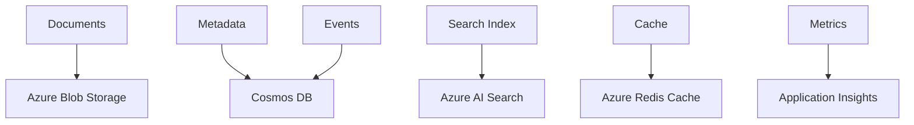
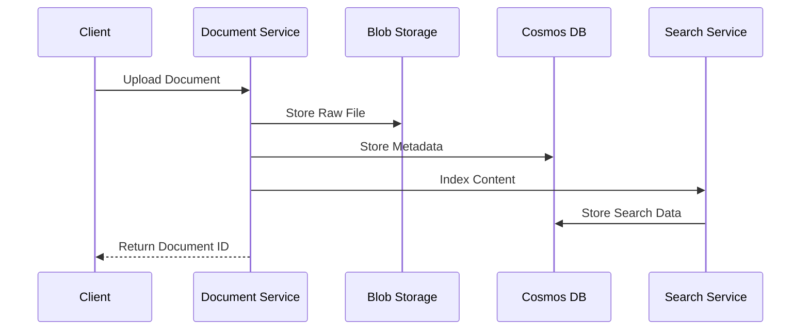
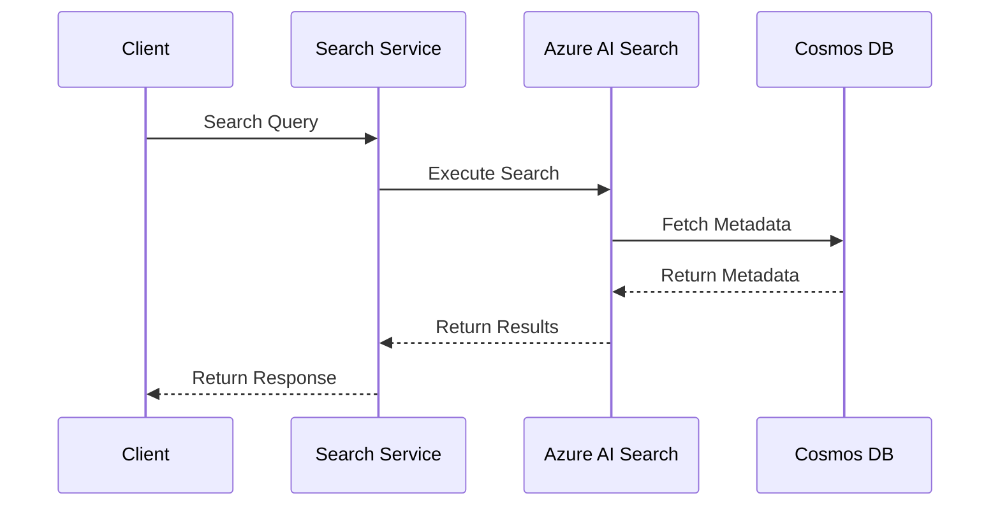

# Data Architecture

## Overview
IntelliVault's data architecture is designed to handle large-scale document storage, efficient retrieval, and analytics processing while maintaining data integrity, security, and compliance requirements.

## Data Models

### Document Model
```typescript
interface Document {
  id: string;
  title: string;
  contentType: string;
  size: number;
  hash: string;
  status: DocumentStatus;
  metadata: DocumentMetadata;
  permissions: Permission[];
  versions: Version[];
  created: Timestamp;
  modified: Timestamp;
}

interface DocumentMetadata {
  author: string;
  organization: string;
  tags: string[];
  customFields: Record<string, any>;
  contentLanguage: string;
  pageCount: number;
  classification: string;
}

interface Version {
  id: string;
  documentId: string;
  versionNumber: number;
  changelog: string;
  contentHash: string;
  created: Timestamp;
  createdBy: string;
}
```

### Search Model
```typescript
interface SearchDocument {
  id: string;
  documentId: string;
  content: string;
  metadata: DocumentMetadata;
  embeddings: number[];
  vectors: {
    text: number[];
    title: number[];
    metadata: number[];
  };
  tokens: number;
}

interface SearchQuery {
  query: string;
  filters: Filter[];
  facets: string[];
  page: number;
  size: number;
  sortBy?: string;
  sortOrder?: 'asc' | 'desc';
}
```

### Analytics Model
```typescript
interface DocumentEvent {
  id: string;
  documentId: string;
  eventType: EventType;
  userId: string;
  timestamp: Timestamp;
  metadata: Record<string, any>;
}

interface SearchEvent {
  id: string;
  queryId: string;
  userId: string;
  query: string;
  filters: Filter[];
  resultCount: number;
  timestamp: Timestamp;
}

interface SystemMetric {
  name: string;
  value: number;
  tags: Record<string, string>;
  timestamp: Timestamp;
}
```

## Data Storage Architecture

### Storage Systems


### Storage Patterns

#### Document Storage
- Raw documents in Blob Storage
- Content-addressable storage using SHA-256
- Hierarchical container organization
- Hot/cool tier optimization
- Lifecycle management

#### Metadata Storage
- Cosmos DB for document metadata
- Partitioned by organization
- Secondary indexes for common queries
- Change feed for real-time updates
- Point-in-time recovery

#### Search Index
- Azure AI Search for full-text search
- Vector embeddings for similarity
- Faceted search capabilities
- Semantic ranking
- Custom scoring profiles

## Data Flow Patterns

### Document Processing Flow


### Search Flow


## Data Consistency

### Consistency Models
1. Document Consistency
   - Strong consistency for metadata
   - Eventual consistency for search index
   - Cache consistency with TTL

2. Transaction Boundaries
   - Atomic document operations
   - Cross-service consistency
   - Compensation patterns

### Versioning Strategy
```typescript
interface VersioningStrategy {
  versioningModel: 'incremental';
  storageModel: 'full-copy';
  retentionPolicy: {
    maxVersions: number;
    maxAge: Duration;
  };
  pruningStrategy: 'time-based' | 'count-based';
}
```

## Data Security

### Encryption
```typescript
interface EncryptionConfig {
  atRest: {
    algorithm: 'AES-256';
    keyRotation: Duration;
    keyVault: string;
  };
  inTransit: {
    protocol: 'TLS-1.3';
    cipherSuites: string[];
  };
}
```

### Access Control
```typescript
interface DataAccessControl {
  rbac: {
    roles: Role[];
    permissions: Permission[];
    policies: Policy[];
  };
  dataClassification: {
    levels: Classification[];
    handlers: Handler[];
  };
}
```

## Data Retention and Lifecycle

### Retention Policies
```yaml
retention:
  documents:
    active: infinite
    archived: 7 years
    deleted: 30 days
  
  events:
    raw: 90 days
    aggregated: 1 year
    
  metrics:
    raw: 30 days
    aggregated: 2 years
```

### Lifecycle Management
```typescript
interface LifecyclePolicy {
  stages: {
    active: StorageConfig;
    archived: StorageConfig;
    deleted: StorageConfig;
  };
  transitions: {
    toArchive: Condition[];
    toDelete: Condition[];
  };
}
```

## Backup and Recovery

### Backup Strategy
```yaml
backup:
  metadata:
    type: continuous
    retention: 30 days
    geo-redundant: true
    
  documents:
    type: daily
    retention: 90 days
    geo-redundant: true
    
  search:
    type: weekly
    retention: 30 days
```

### Recovery Procedures
1. Point-in-time metadata recovery
2. Document content restoration
3. Search index rebuilding
4. System state recovery

## Performance Optimization

### Caching Strategy
```typescript
interface CacheConfig {
  layers: {
    memory: TTLConfig;
    redis: TTLConfig;
  };
  patterns: {
    readThrough: boolean;
    writeThrough: boolean;
    writeBack: boolean;
  };
}
```

### Index Optimization
```yaml
indexing:
  sharding:
    strategy: organization-based
    shardCount: 10
  
  optimization:
    scheduling: off-peak
    parallelism: 5
    batchSize: 1000
```

## Monitoring and Analytics

### Data Metrics
```typescript
interface DataMetrics {
  storage: {
    usage: Gauge;
    growth: Rate;
    operations: Counter;
  };
  performance: {
    latency: Histogram;
    throughput: Meter;
  };
}
```

### Health Monitoring
```yaml
healthChecks:
  storage:
    - blob connectivity
    - cosmos latency
    - index freshness
  
  consistency:
    - replication lag
    - index lag
    - cache hit rate
```