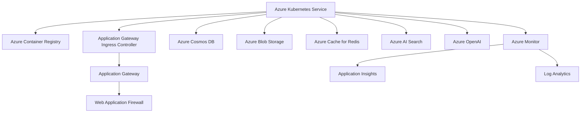
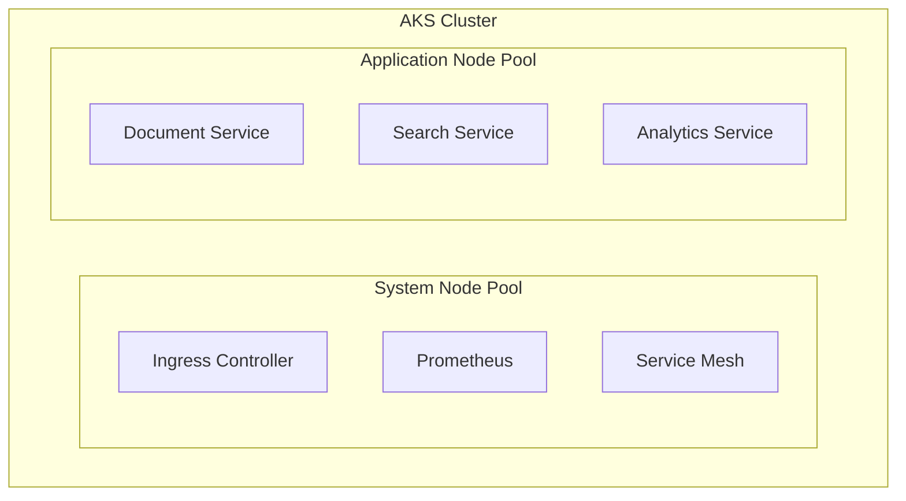
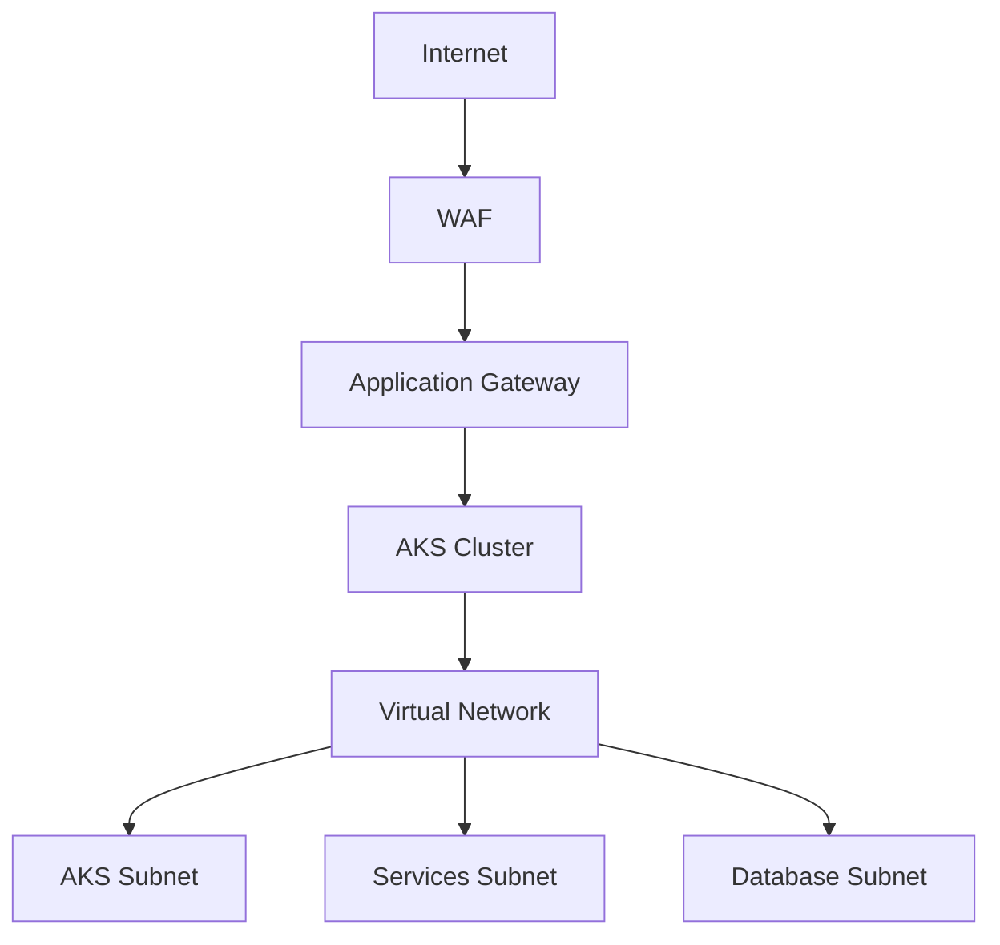

# Infrastructure Architecture

## Overview
IntelliVault's infrastructure is built on Azure cloud services, utilizing Azure Kubernetes Service (AKS) as the primary container orchestration platform, along with various managed services for storage, databases, and AI capabilities.

## Infrastructure Components

### Azure Resources Diagram


## Azure Services Configuration

### Azure Kubernetes Service (AKS)
```yaml
# AKS Configuration
cluster:
  name: intellivault-aks
  version: 1.26
  nodeGroups:
    system:
      vmSize: Standard_D4s_v3
      count: 3
      minCount: 3
      maxCount: 5
    application:
      vmSize: Standard_D8s_v3
      count: 5
      minCount: 3
      maxCount: 10
  networking:
    plugin: azure
    serviceCidr: 10.0.0.0/16
    dnsServiceIP: 10.0.0.10
    dockerBridgeCidr: 172.17.0.1/16
```

### Azure Container Registry (ACR)
```yaml
# ACR Configuration
registry:
  name: intellivaultacr
  sku: Premium
  replication:
    enabled: true
    regions: [eastus, westus]
  security:
    adminEnabled: false
    scopedTokens: true
```

### Application Gateway
```yaml
# Application Gateway Configuration
appGateway:
  name: intellivault-agw
  sku: WAF_v2
  tier: WAF_v2
  capacity: 2
  wafMode: Prevention
  sslPolicy:
    minProtocolVersion: TLSv1_2
  zones: [1, 2, 3]
```

## Kubernetes Infrastructure

### Cluster Architecture


### Kubernetes Resources

#### Namespace Structure
```yaml
namespaces:
  - name: ingress
    description: Ingress controllers and certificates
  - name: monitoring
    description: Monitoring and logging
  - name: intellivault
    description: Application services
```

#### Resource Quotas
```yaml
apiVersion: v1
kind: ResourceQuota
metadata:
  name: intellivault-quota
spec:
  hard:
    requests.cpu: "20"
    requests.memory: 40Gi
    limits.cpu: "40"
    limits.memory: 80Gi
    pods: "50"
```

## Networking Architecture

### Network Topology


### Network Security

#### Network Security Groups
```yaml
nsgs:
  aks:
    inbound:
      - port: 443
        source: ApplicationGateway
      - port: 9000
        source: AzureMonitor
  database:
    inbound:
      - port: 1433
        source: AKS
      - port: 1433
        source: DevOps
```

#### Service Mesh Configuration
```yaml
serviceMesh:
  type: istio
  features:
    - mTLS
    - authorization
    - monitoring
    - tracing
  policies:
    - name: default
      mTLS: STRICT
    - name: monitoring
      mTLS: PERMISSIVE
```

## Storage Infrastructure

### Azure Blob Storage
```yaml
storage:
  name: intellivaultstorage
  sku: Standard_ZRS
  kind: StorageV2
  containers:
    - name: documents
      access: private
    - name: temp
      access: private
      retention: 24h
```

### Azure Cosmos DB
```yaml
cosmosDB:
  name: intellivault-cosmos
  api: SQL
  consistency: Session
  regions:
    - name: East US
      failover: 0
    - name: West US
      failover: 1
```

## Monitoring Infrastructure

### Azure Monitor Configuration
```yaml
monitoring:
  workspace:
    name: intellivault-logs
    retentionDays: 30
  
  metrics:
    - name: pod_cpu
      interval: 1m
    - name: pod_memory
      interval: 1m
    - name: http_requests
      interval: 30s
```

### Application Insights
```yaml
appInsights:
  name: intellivault-insights
  kind: web
  sampling:
    percentage: 100
  retention: 90
  workbooks:
    - name: Service Health
    - name: Performance Analysis
```

## Scaling and High Availability

### Autoscaling Configuration
```yaml
horizontalPodAutoscaler:
  document-service:
    minReplicas: 3
    maxReplicas: 10
    metrics:
      - type: Resource
        resource:
          name: cpu
          target:
            type: Utilization
            averageUtilization: 70

verticalPodAutoscaler:
  enabled: true
  updateMode: Auto
```

### High Availability Design
- Multi-zone AKS deployment
- Regional failover configuration
- Load balancing across zones
- Data replication strategy
- Disaster recovery plan

## DevOps Infrastructure

### CI/CD Pipeline
```yaml
pipeline:
  triggers:
    - main
    - develop
  
  stages:
    - name: Build
      jobs:
        - build
        - test
        - security-scan
    
    - name: Deploy
      environments:
        - staging
        - production
      approval:
        production: manual
```

### Infrastructure as Code
- Terraform for Azure resources
- Helm charts for Kubernetes
- ARM templates for legacy components
- GitHub Actions for automation
- Azure DevOps for deployment