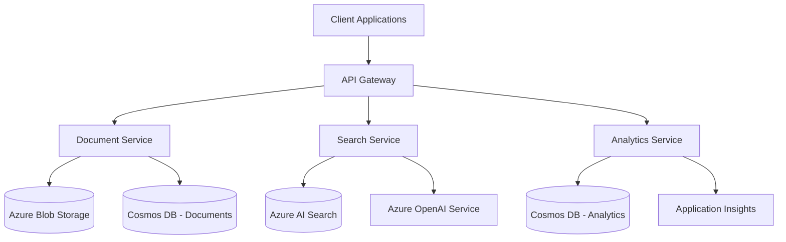

# IntelliVault Architecture Overview

## Introduction
IntelliVault is a distributed microservices-based intelligent document management system built on Azure cloud infrastructure. This document provides a comprehensive overview of the system architecture, design principles, and key components.

## System Architecture

### High-Level Architecture

### Core Components

#### 1. Document Service
- Handles document upload, processing, and storage
- Manages document metadata and access control
- Integrates with Azure Blob Storage for raw document storage
- Uses Cosmos DB for document metadata and state management

#### 2. Search Service
- Provides semantic search capabilities
- Implements vector-based similarity search
- Manages search index and document embeddings
- Integrates with Azure AI Search and Azure OpenAI

#### 3. Analytics Service
- Collects and processes usage analytics
- Generates document insights and trends
- Provides system metrics and performance data
- Integrates with Application Insights for monitoring

## Design Principles

### 1. Security-First Architecture
- Zero-trust security model
- End-to-end encryption
- Role-based access control (RBAC)
- Audit logging and compliance tracking

### 2. Scalability and Performance
- Horizontal scaling through Kubernetes
- Distributed caching and load balancing
- Asynchronous processing for long-running tasks
- Multi-region deployment support

### 3. Resilience and Reliability
- Circuit breakers and fallbacks
- Retry policies with exponential backoff
- Data replication and backup strategies
- Health monitoring and auto-recovery

### 4. Observability
- Distributed tracing
- Centralized logging
- Real-time metrics
- Performance monitoring

## Technical Stack

### Backend Services
- Language: TypeScript/Node.js 18+
- Framework: Express.js/NestJS
- Testing: Jest
- API Documentation: OpenAPI/Swagger

### Infrastructure
- Container Orchestration: Azure Kubernetes Service (AKS)
- CI/CD: GitHub Actions & Azure DevOps
- Monitoring: Azure Monitor & Application Insights
- Service Mesh: Azure Service Mesh

### Data Storage
- Document Storage: Azure Blob Storage
- Metadata & State: Azure Cosmos DB
- Search Index: Azure AI Search
- Cache Layer: Azure Redis Cache

### AI/ML Services
- Text Processing: Azure OpenAI Service
- Vector Search: Azure AI Search
- Analytics: Azure Machine Learning

## Performance Goals
- Search latency < 2s (95th percentile)
- Document processing < 5 minutes
- 1000+ concurrent users
- 10,000 documents/hour processing throughput

## System Requirements
- 99.9% availability SLA
- Data residency compliance
- AES-256 encryption for data at rest
- TLS 1.3 for data in transit

## Future Considerations
1. Multi-tenant architecture support
2. Enhanced AI-powered document analysis
3. Real-time collaboration features
4. Advanced document versioning
5. Integration with third-party AI services

## Related Documentation
- [Service Architecture](services/)
- [Infrastructure Documentation](infrastructure.md)
- [Data Architecture](data-architecture.md)
- [Security Architecture](security.md)
- [API Documentation](../api/)