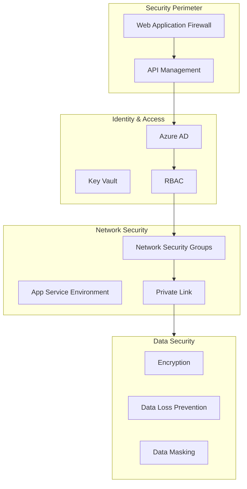
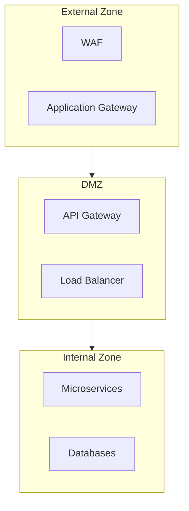

# Security Architecture

## Overview
IntelliVault implements a comprehensive security architecture following the zero-trust principle, ensuring data protection, access control, and compliance with industry standards.

## Security Framework

### Security Architecture Diagram


## Authentication and Authorization

### Identity Management
```typescript
interface IdentityConfig {
  provider: 'Azure AD';
  features: {
    mfa: boolean;
    conditionalAccess: boolean;
    passwordPolicy: PasswordPolicy;
    deviceCompliance: boolean;
  };
  integration: {
    sso: boolean;
    scim: boolean;
    oauth: OAuthConfig;
  };
}
```

### Role-Based Access Control
```yaml
roles:
  - name: SystemAdmin
    permissions:
      - manage:all
      - audit:all
    
  - name: DocumentAdmin
    permissions:
      - manage:documents
      - read:analytics
    
  - name: Auditor
    permissions:
      - read:audit
      - read:analytics
    
  - name: User
    permissions:
      - read:documents
      - write:documents
```

### Access Policies
```typescript
interface AccessPolicy {
  scope: 'organization' | 'team' | 'user';
  permissions: Permission[];
  conditions: {
    ipRange?: string[];
    timeWindow?: TimeRange;
    deviceCompliance?: boolean;
    riskLevel?: RiskLevel;
  };
}
```

## Network Security

### Network Architecture


### Network Policies
```yaml
networkPolicies:
  ingress:
    - from: WAF
      to: API Gateway
      ports: [443]
      protocol: TCP
    
  egress:
    - from: Services
      to: Databases
      ports: [1433]
      protocol: TCP
```

### Network Isolation
```typescript
interface NetworkIsolation {
  vnet: {
    addressSpace: string;
    subnets: Subnet[];
  };
  serviceMesh: {
    mTLS: boolean;
    authorization: boolean;
    monitoring: boolean;
  };
}
```

## Data Protection

### Encryption Strategy
```yaml
encryption:
  atRest:
    algorithm: AES-256-GCM
    keyManagement: Azure Key Vault
    keyRotation: 90 days
    
  inTransit:
    protocol: TLS 1.3
    minimumStrength: 256-bit
    preferredCipherSuites:
      - TLS_AES_256_GCM_SHA384
      - TLS_CHACHA20_POLY1305_SHA256
```

### Data Classification
```typescript
interface DataClassification {
  levels: {
    public: ClassificationPolicy;
    internal: ClassificationPolicy;
    confidential: ClassificationPolicy;
    restricted: ClassificationPolicy;
  };
  handling: {
    encryption: boolean;
    masking: boolean;
    audit: boolean;
    retention: Duration;
  };
}
```

### Key Management
```yaml
keyManagement:
  provider: Azure Key Vault
  keyTypes:
    - encryption
    - signing
    - certificates
  rotation:
    automatic: true
    schedule: 90 days
  backup:
    enabled: true
    location: geo-redundant
```

## Compliance and Audit

### Audit Logging
```typescript
interface AuditConfig {
  events: {
    authentication: boolean;
    authorization: boolean;
    dataAccess: boolean;
    systemChanges: boolean;
  };
  retention: {
    online: Duration;
    archive: Duration;
  };
  monitoring: {
    realtime: boolean;
    alerts: AlertConfig[];
  };
}
```

### Compliance Controls
```yaml
compliance:
  standards:
    - SOC2
    - ISO27001
    - GDPR
    
  controls:
    access:
      - authentication
      - authorization
      - audit
    data:
      - encryption
      - classification
      - retention
    system:
      - monitoring
      - backup
      - recovery
```

### Security Monitoring
```typescript
interface SecurityMonitoring {
  detection: {
    threats: boolean;
    anomalies: boolean;
    compliance: boolean;
  };
  response: {
    automatic: boolean;
    manual: boolean;
    escalation: boolean;
  };
  reporting: {
    realtime: boolean;
    scheduled: boolean;
    compliance: boolean;
  };
}
```

## Threat Protection

### WAF Configuration
```yaml
waf:
  mode: Prevention
  rulesets:
    - OWASP 3.2
    - Microsoft_DefaultRuleSet
  customRules:
    - name: GeoBlock
      priority: 1
      action: Block
    - name: RateLimit
      priority: 2
      action: Block
```

### DDoS Protection
```typescript
interface DDoSProtection {
  type: 'Azure DDoS Protection Standard';
  features: {
    volumetric: boolean;
    protocol: boolean;
    application: boolean;
  };
  monitoring: {
    metrics: boolean;
    alerts: boolean;
    reporting: boolean;
  };
}
```

### Vulnerability Management
```yaml
vulnerabilityManagement:
  scanning:
    frequency: daily
    scope:
      - containers
      - applications
      - infrastructure
    
  remediation:
    automatic: true
    approvalRequired: critical
    patchWindow: maintenance-window
```

## Incident Response

### Response Plan
```typescript
interface IncidentResponse {
  phases: {
    detection: ResponseAction[];
    containment: ResponseAction[];
    eradication: ResponseAction[];
    recovery: ResponseAction[];
  };
  communication: {
    internal: CommunicationPlan;
    external: CommunicationPlan;
  };
  documentation: {
    required: boolean;
    template: string;
  };
}
```

### Recovery Procedures
```yaml
recovery:
  procedures:
    - name: SystemRestore
      type: full
      rto: 4h
      rpo: 15m
    
    - name: DataRecovery
      type: point-in-time
      rto: 2h
      rpo: 5m
```

## Security Operations

### Monitoring and Alerts
```typescript
interface SecurityOperations {
  monitoring: {
    siem: boolean;
    soar: boolean;
    edr: boolean;
  };
  alerts: {
    severity: Severity[];
    channels: Channel[];
    escalation: EscalationPath[];
  };
  reporting: {
    daily: Report[];
    weekly: Report[];
    monthly: Report[];
  };
}
```

### Security Updates
```yaml
securityUpdates:
  automated:
    os: true
    applications: true
    dependencies: true
    
  schedule:
    critical: immediate
    high: 24h
    medium: 72h
    low: 7d
```