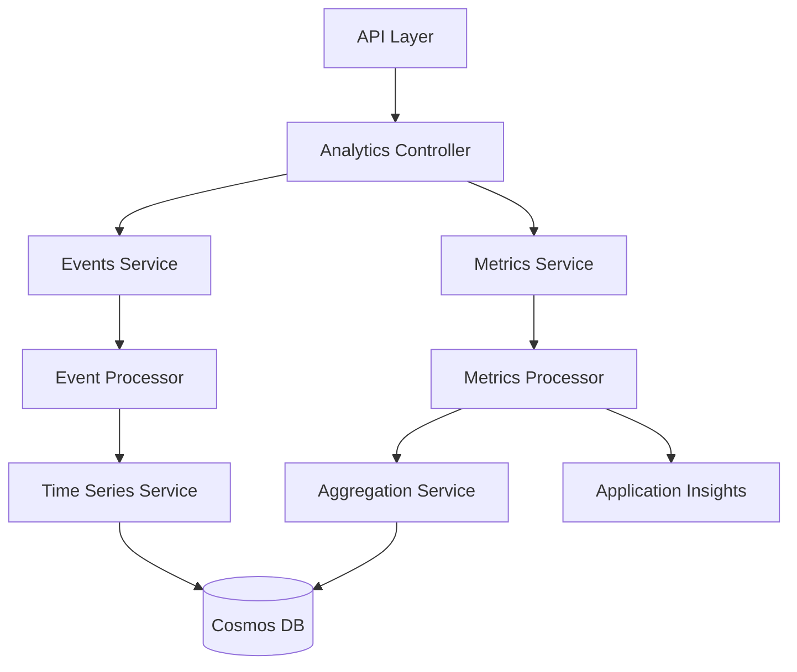
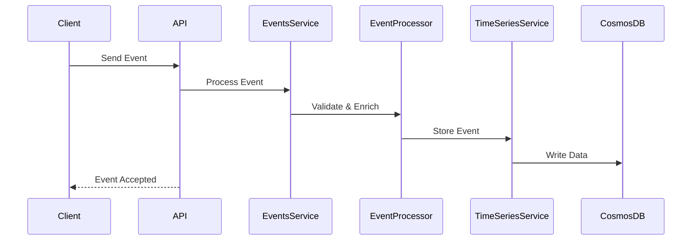
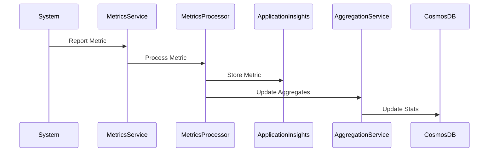

# Analytics Service Architecture

## Overview
The Analytics Service collects, processes, and provides insights about document usage, search patterns, and system performance metrics.

## Service Architecture

### Component Diagram


## Core Components

### 1. Events Service
- Event collection
- Event validation
- Event enrichment
- Event routing
- Event storage

### 2. Metrics Service
- Metrics collection
- Real-time processing
- Metric aggregation
- Trend analysis
- Alert generation

### 3. Time Series Service
- Time-based analytics
- Historical analysis
- Trend prediction
- Data rollup
- Data retention

### 4. Aggregation Service
- Data aggregation
- Statistical analysis
- Report generation
- Data export
- Cache management

## Data Flow

1. Event Processing Flow


2. Metrics Collection Flow


## API Endpoints

### Analytics API
```typescript
// Document analytics
GET /api/v1/analytics/documents
GET /api/v1/analytics/documents/{id}

// Search analytics
GET /api/v1/analytics/search
GET /api/v1/analytics/search/trends

// System metrics
GET /api/v1/analytics/system
GET /api/v1/analytics/system/health
```

### Event Collection
```typescript
// Track document event
POST /api/v1/events/documents
{
  documentId: string;
  eventType: 'view' | 'download' | 'share';
  userId: string;
  metadata: any;
}

// Track search event
POST /api/v1/events/search
{
  queryId: string;
  query: string;
  results: number;
  filters: any;
}
```

## Analytics Types

### Document Analytics
```typescript
interface DocumentAnalytics {
  views: number;
  downloads: number;
  shares: number;
  uniqueUsers: number;
  averageViewTime: number;
  popularSections: Section[];
}
```

### Search Analytics
```typescript
interface SearchAnalytics {
  totalQueries: number;
  uniqueQueries: number;
  averageResults: number;
  popularTerms: Term[];
  failedQueries: FailedQuery[];
}
```

### System Analytics
```typescript
interface SystemAnalytics {
  activeUsers: number;
  requestRate: number;
  errorRate: number;
  latency: LatencyMetrics;
  resourceUsage: ResourceMetrics;
}
```

## Data Storage

### Event Storage
- Event type partitioning
- Time-based sharding
- Hot/cold data separation
- Data compression
- Archival strategy

### Metrics Storage
- Real-time metrics
- Aggregated metrics
- Historical metrics
- System metrics
- Custom metrics

## Configuration

### Environment Variables
```typescript
interface Config {
  // Service Configuration
  PORT: number;
  NODE_ENV: string;
  
  // Cosmos DB
  COSMOS_DB_CONNECTION: string;
  COSMOS_DB_DATABASE: string;
  
  // Application Insights
  APP_INSIGHTS_KEY: string;
  
  // Analytics Configuration
  EVENT_BATCH_SIZE: number;
  AGGREGATION_INTERVAL: number;
  RETENTION_PERIOD: number;
}
```

## Processing Pipeline

### Event Processing
1. Event validation
2. Event enrichment
3. Real-time processing
4. Batch processing
5. Storage optimization

### Metrics Processing
1. Data collection
2. Aggregation
3. Analysis
4. Alerting
5. Reporting

## Monitoring and Alerts

### Key Metrics
- Event processing rate
- Processing latency
- Storage usage
- Query performance
- Error rates

### Alerts
- Processing delays
- Error thresholds
- Storage capacity
- Performance degradation
- System health

## Security Measures

### Data Protection
- Event data encryption
- Personal data anonymization
- Data retention policies
- Access control

### Compliance
- Audit logging
- Data privacy
- Regulatory compliance
- Data governance

### Authentication
- Service authentication
- API key validation
- Token verification

## Reporting

### Report Types
1. Usage Reports
   - Document activity
   - User engagement
   - Search patterns

2. Performance Reports
   - System metrics
   - Service health
   - Resource utilization

3. Custom Reports
   - Ad-hoc analysis
   - Custom metrics
   - Export formats