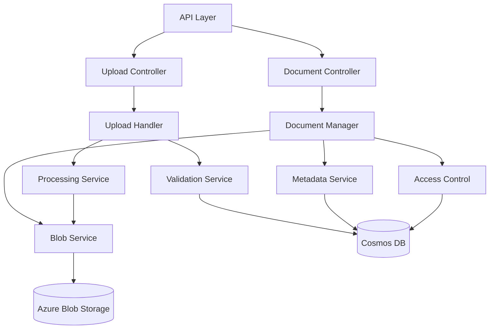
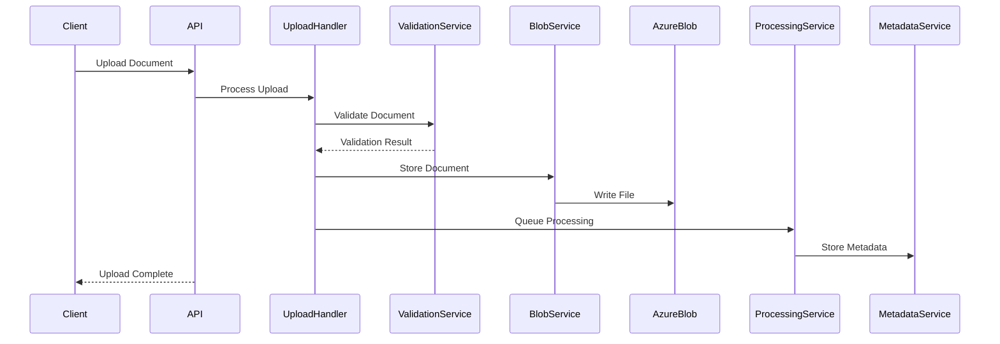
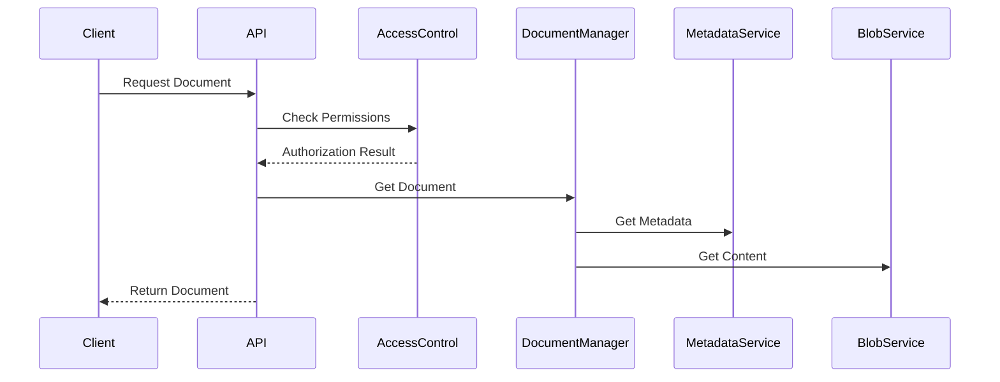

# Document Service Architecture

## Overview
The Document Service is responsible for managing document uploads, processing, storage, and access control within the IntelliVault system.

## Service Architecture

### Component Diagram


## Core Components

### 1. API Layer
- RESTful API endpoints
- Request validation
- Authentication & authorization
- Rate limiting
- Response formatting

### 2. Upload Handler
- Multipart file upload processing
- File type validation
- Virus scanning
- Initial metadata extraction
- Queueing for async processing

### 3. Document Manager
- Document lifecycle management
- Version control
- Access control enforcement
- Metadata management
- Storage optimization

### 4. Processing Service
- Document parsing
- Text extraction
- Metadata enrichment
- Format conversion
- Thumbnail generation

### 5. Storage Services
- Blob storage management
- Metadata storage
- Caching layer
- Data replication
- Backup management

## Data Flow

1. Document Upload Flow


2. Document Retrieval Flow


## API Endpoints

### Document Management
```typescript
// Upload document
POST /api/v1/documents
Content-Type: multipart/form-data

// Get document metadata
GET /api/v1/documents/{id}

// Update document metadata
PATCH /api/v1/documents/{id}

// Delete document
DELETE /api/v1/documents/{id}

// Get document content
GET /api/v1/documents/{id}/content

// List documents
GET /api/v1/documents?page={page}&size={size}
```

### Version Management
```typescript
// Get document versions
GET /api/v1/documents/{id}/versions

// Create new version
POST /api/v1/documents/{id}/versions

// Get specific version
GET /api/v1/documents/{id}/versions/{versionId}
```

## Configuration

### Environment Variables
```typescript
interface Config {
  // Service Configuration
  PORT: number;
  NODE_ENV: string;
  
  // Azure Blob Storage
  AZURE_STORAGE_CONNECTION_STRING: string;
  BLOB_CONTAINER_NAME: string;
  
  // Cosmos DB
  COSMOS_DB_CONNECTION_STRING: string;
  COSMOS_DB_DATABASE: string;
  
  // Security
  JWT_SECRET: string;
  ENCRYPTION_KEY: string;
  
  // Processing
  MAX_FILE_SIZE: number;
  ALLOWED_MIME_TYPES: string[];
  PROCESSING_QUEUE_URL: string;
}
```

## Error Handling

### Error Categories
1. ValidationError - Invalid input or file format
2. AuthorizationError - Permission issues
3. StorageError - Blob storage problems
4. ProcessingError - Document processing failures
5. DatabaseError - Metadata storage issues

### Error Response Format
```typescript
interface ErrorResponse {
  error: {
    code: string;
    message: string;
    details?: any;
    requestId: string;
  }
}
```

## Monitoring and Metrics

### Key Metrics
- Upload success rate
- Processing time
- Storage usage
- Error rates
- API latency
- Active users

### Health Checks
- Blob storage connectivity
- Database connectivity
- Processing queue health
- Memory usage
- CPU utilization

## Security Measures

### Authentication
- JWT token validation
- API key authentication
- OAuth2 integration

### Authorization
- Role-based access control
- Document-level permissions
- Tenant isolation

### Data Protection
- In-transit encryption (TLS 1.3)
- At-rest encryption (AES-256)
- Key rotation
- Audit logging