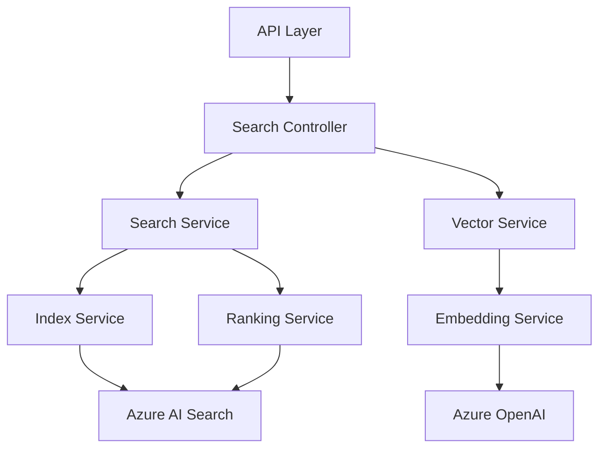
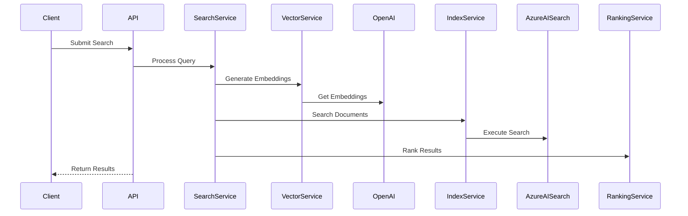
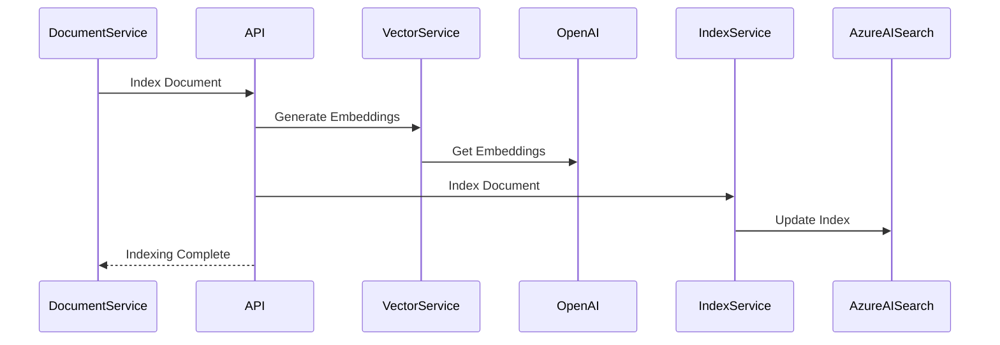

# Search Service Architecture

## Overview
The Search Service provides advanced semantic search capabilities using Azure AI Search and Azure OpenAI, enabling intelligent document discovery and similarity matching.

## Service Architecture

### Component Diagram


## Core Components

### 1. API Layer
- Search query endpoints
- Query validation
- Response formatting
- Rate limiting
- Caching

### 2. Search Service
- Query processing
- Filter application
- Facet generation
- Result aggregation
- Score normalization

### 3. Vector Service
- Text embedding generation
- Vector similarity computation
- Embedding cache management
- Batch processing
- Model management

### 4. Index Service
- Search index management
- Document indexing
- Index optimization
- Schema management
- Reindexing operations

## Data Flow

1. Search Query Flow


2. Document Indexing Flow


## API Endpoints

### Search Operations
```typescript
// Semantic search
POST /api/v1/search
{
  query: string;
  filters?: SearchFilter[];
  page: number;
  size: number;
}

// Similar document search
GET /api/v1/search/similar/{documentId}

// Search suggestions
GET /api/v1/search/suggest?q={query}

// Search facets
GET /api/v1/search/facets
```

### Index Management
```typescript
// Reindex document
POST /api/v1/index/{documentId}

// Delete from index
DELETE /api/v1/index/{documentId}

// Get index stats
GET /api/v1/index/stats
```

## Search Features

### Query Types
1. Semantic Search
   - Natural language queries
   - Keyword search
   - Phrase matching
   - Fuzzy matching

2. Vector Search
   - Similar document finding
   - Content-based recommendations
   - Semantic clustering

3. Hybrid Search
   - Combined keyword and vector search
   - Weighted scoring
   - Context-aware ranking

### Filtering & Faceting
```typescript
interface SearchFilter {
  field: string;
  operator: 'eq' | 'gt' | 'lt' | 'between' | 'in';
  value: any;
}

interface SearchFacet {
  field: string;
  type: 'terms' | 'range' | 'date';
  options?: FacetOption[];
}
```

## Configuration

### Environment Variables
```typescript
interface Config {
  // Service Configuration
  PORT: number;
  NODE_ENV: string;
  
  // Azure AI Search
  AZURE_SEARCH_SERVICE: string;
  AZURE_SEARCH_INDEX: string;
  AZURE_SEARCH_KEY: string;
  
  // Azure OpenAI
  AZURE_OPENAI_ENDPOINT: string;
  AZURE_OPENAI_KEY: string;
  AZURE_OPENAI_DEPLOYMENT: string;
  
  // Search Configuration
  MAX_RESULTS: number;
  MIN_SCORE: number;
  CACHE_TTL: number;
}
```

## Performance Optimization

### Caching Strategy
- Query result caching
- Embedding caching
- Facet caching
- Suggestion caching

### Search Optimization
- Index optimization
- Query optimization
- Result scoring
- Batch processing

## Monitoring and Metrics

### Key Metrics
- Query latency
- Search relevance
- Cache hit rate
- Index size
- API usage
- Error rates

### Health Checks
- Azure AI Search connectivity
- Azure OpenAI availability
- Cache health
- Index health
- API response time

## Security Measures

### Authentication
- Service-to-service auth
- API key validation
- Token validation

### Authorization
- Search scope control
- Result filtering
- Rate limiting

### Data Protection
- Query logging
- Result auditing
- Data encryption
- Access monitoring